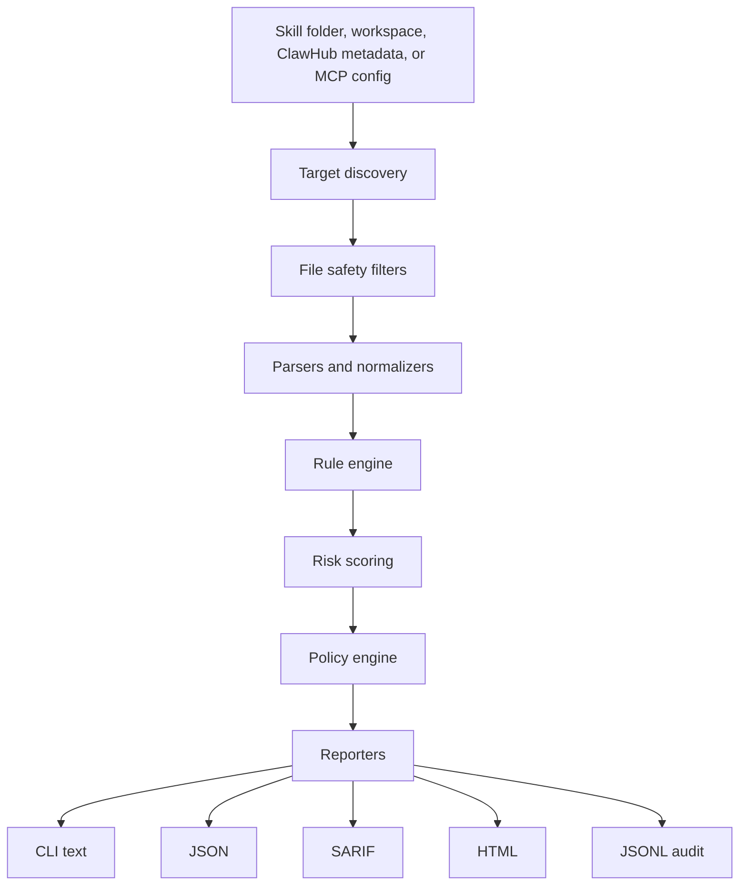

# ClawShield Architecture

ClawShield is an independent static governance layer for OpenClaw-style skills, ClawHub packages, and MCP/tool configs. It should stay compatible with OpenClaw without pretending to be OpenClaw.

## Mission

ClawShield answers one question before a user trusts a skill or plugin:

> What can this thing influence, access, install, or exfiltrate?

The product should be small, explainable, and useful in three moments:

- Before installing a skill or plugin.
- After installing into an OpenClaw workspace.
- During pull requests and publishing workflows.

## Product Surfaces

1. CLI

   Current surface: `clawshield scan <path>`.

   Target surface:

   - `clawshield scan <path>`
   - `clawshield scan-skill <skill-dir>`
   - `clawshield scan-workspace <workspace-dir>`
   - `clawshield scan-mcp <config-path>`
   - `clawshield explain <finding-id>`
   - `clawshield policy check <report.json>`

2. Core library

   A dependency-free or low-dependency JavaScript API that other surfaces call. The CLI, GitHub Action, web demo, and MCP server should all use the same core scanner.

3. GitHub Action

   Pull request gate for skill repos, OpenClaw companion repos, and enterprise skill catalogs. It should output CLI text, JSON artifact, and SARIF.

4. Web demo

   Public demo: upload or paste `SKILL.md`, optionally upload a folder, then get a risk score with evidence and recommended action.

5. MCP server

   Optional later surface exposing tools like `scan_skill`, `scan_mcp_config`, `explain_finding`, and `policy_decision`.

6. Install gate

   Optional wrapper or integration pattern around OpenClaw/ClawHub install/update flows. It should scan a downloaded bundle before the user enables it.

## Trust Boundaries

ClawShield must treat every scanned file as hostile input.

Security invariants:

- Never execute scanned files.
- Never install dependencies from scanned files.
- Do not fetch remote code by default.
- Do not follow symbolic links by default.
- Enforce size and file count limits.
- Keep evidence short and bounded.
- Do not print full secrets.
- Keep rules deterministic and explainable.
- Fail closed in CI when configured by policy.

## High-Level Flow



## Core Modules

Current code can evolve into these modules without a rewrite:

- `src/cli.js`: command parsing and terminal output.
- `src/scanner.js`: orchestration, target walking, file safety limits, and scan result construction.
- `src/rules.js`: initial static rule pack.

Target architecture:

- `src/core/scan.js`: main scanner orchestration.
- `src/core/types.js`: shared contracts for targets, findings, scores, policies, and reports.
- `src/fs/discovery.js`: safe traversal, symlink behavior, max file size, ignore rules.
- `src/parsers/skill.js`: `SKILL.md` detection, frontmatter extraction, metadata normalization.
- `src/parsers/package.js`: `package.json`, script, dependency, and lifecycle analysis.
- `src/parsers/mcp.js`: MCP and plugin config parsing.
- `src/parsers/clawhub.js`: ClawHub origin, lockfile, and package metadata parsing.
- `src/rules/*.js`: rule packs by domain.
- `src/risk/scoring.js`: severity weights, confidence, caps, and summary.
- `src/policy/engine.js`: decisions such as allow, warn, manual review, sandbox required, and block.
- `src/reporters/*.js`: human, JSON, SARIF, HTML, and JSONL output.
- `src/integrations/*`: GitHub Action, OpenClaw/ClawHub wrappers, MCP server, web demo adapter.

## Data Contracts

Scan target:

```js
{
  kind: "skill" | "workspace" | "mcp-config" | "clawhub-package" | "directory" | "file",
  path: "/absolute/path",
  source: "local" | "clawhub" | "github" | "upload",
  metadata: {}
}
```

Finding:

```js
{
  id: "credential-access",
  title: "References credentials or environment secrets",
  severity: "high",
  confidence: "medium",
  category: "secret-access",
  file: "SKILL.md",
  line: 14,
  evidence: "process.env.TODOIST_API_KEY",
  recommendation: "Declare required env vars and verify least privilege.",
  tags: ["openclaw", "frontmatter-mismatch"]
}
```

Risk score:

```js
{
  score: 72,
  level: "critical",
  findingCounts: { low: 0, medium: 1, high: 2, critical: 1 },
  reasons: ["remote-code-execution", "undeclared-env-access"]
}
```

Policy decision:

```js
{
  decision: "block",
  preset: "enterprise",
  reason: "Critical finding and undeclared network/system access.",
  requiredActions: ["sandbox", "manual-review", "declare-permissions"]
}
```

## Rule Packs

Core rule packs:

- `core-static`: remote code execution, destructive shell, obfuscation, credential access, data exfiltration.
- `skill-metadata`: missing name/description/version, undeclared env vars, undeclared binaries, undeclared config reads, install metadata mismatch.
- `openclaw-permissions`: broad tool categories, high-risk workspace paths, sandbox recommendations, skill precedence warnings.
- `clawhub-supply-chain`: origin metadata, version drift, unsigned or unknown source, install specs, package risk metadata.
- `mcp-config`: broad MCP tools, unknown command sources, network/system capabilities, token-heavy env injection.
- `prompt-injection`: instruction hijacking, policy bypass language, credential disclosure instructions.

## Risk Model

Risk should be explainable before it is clever.

Base severity:

- `info`: noteworthy but not dangerous.
- `low`: likely safe but worth visibility.
- `medium`: could surprise the user or expand trust.
- `high`: can access secrets, files, network, tools, or external systems.
- `critical`: can execute remote code, destroy data, silently exfiltrate, or bypass controls.

Score factors:

- Severity weight.
- Number of unique findings.
- Confidence.
- Capability category.
- Declared versus observed mismatch.
- Source trust.
- Whether sandboxing is available or required.
- Whether the finding is in executable code, frontmatter, docs, or examples.

## Policy Model

The policy engine maps scan results into decisions:

- `allow`: no action required.
- `warn`: show risk, allow user to continue.
- `manual_review`: require human approval.
- `sandbox_required`: allow only with sandbox or limited tools.
- `dual_approval`: require two reviewers for enterprise workflows.
- `block`: do not install or enable.

Presets:

- `personal`: warn on medium, block critical.
- `governed`: review medium, sandbox high, block critical.
- `enterprise`: review medium, dual approval high, block critical and undeclared sensitive access.

## OpenClaw Workspace Model

OpenClaw skill precedence matters. A workspace skill can override a managed or bundled skill. ClawShield should eventually scan and display:

- All visible skill locations.
- Duplicate skill names.
- Effective winning skill by precedence.
- Skills enabled by agent allowlists.
- Skills shipped by plugins.
- Skills loaded from extra directories.

This becomes the foundation for an `openclaw doctor` style companion command:

```bash
clawshield openclaw scan-workspace ~/.openclaw/workspace
```

## ClawHub Model

ClawShield should consume ClawHub metadata when available, but should not rely on it as the only authority.

Useful ClawHub signals:

- Skill slug, version, tag, changelog, origin, and lockfile state.
- `metadata.openclaw` runtime requirements.
- Install specs such as `brew`, `node`, `go`, or `uv`.
- Package family, trust, capability, compatibility, and source metadata.
- Registry moderation and report status if exposed by API later.

ClawShield should compare registry declarations with local bundle behavior.

## Reports

Every report should include:

- Target path and target kind.
- Source and metadata if available.
- Files scanned and skipped.
- Risk score and policy decision.
- Findings grouped by severity and category.
- Evidence with file and line.
- Recommendations.
- Limitations and scan options.

Machine-readable reports should preserve stable finding IDs so suppressions and trend tracking work over time.

## Repository Shape

Near-term repo shape:

```text
clawshield/
+-- src/
|   +-- cli.js
|   +-- scanner.js
|   +-- rules.js
|   +-- parsers/
|   +-- policy/
|   +-- reporters/
|   +-- integrations/
+-- test/
+-- examples/
+-- docs/
+-- .github/workflows/
```

Long-term package shape:

```text
clawshield/
+-- packages/
|   +-- core/
|   +-- cli/
|   +-- action/
|   +-- mcp-server/
|   +-- web/
+-- fixtures/
+-- docs/
+-- examples/
```

Stay single-package until the code is large enough to justify splitting. A clean monolith is better than a premature monorepo.

## Non-Goals

- Do not fork OpenClaw.
- Do not replace ClawHub.
- Do not claim a clean scan proves safety.
- Do not execute untrusted code for analysis.
- Do not build a giant agent framework inside ClawShield.
- Do not collect user skill data by default.

## Success Criteria

ClawShield is strong when:

- A developer can run it in under one minute.
- A maintainer can add it to CI without learning OpenClaw internals.
- A user understands why a skill is risky.
- A security reviewer can see exact evidence.
- An OpenClaw contributor sees it as a useful companion, not a competing platform.
