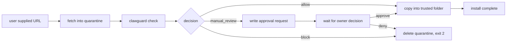

# ClawGuard Install Wrapper Spec

Last reviewed: 2026-05-25.

This document specifies `clawguard install <url>` — the URL-aware extension to the existing local-path `install` command. It is the headline workflow proposed in [STRATEGIC_REVIEW.md](STRATEGIC_REVIEW.md) section 9 item 4: none of the other six "ClawGuard" projects gate the install path end-to-end ([COMPARISON.md](COMPARISON.md)), and this wrapper is the simplest way for ClawGuard to own that surface.

The spec is frozen at v1. The CLI is **implemented for HTTPS tarballs (`.tar.gz` / `.tgz`) and `--resume`** as of 2026-05-26. Zip archives and `clawhub:` URLs are deferred to v1.1 (see "Deferred from v1.0" below). Code lives under [src/install-url/](../src/install-url/) and the payload contract is fixed by [schemas/clawguard-install.schema.json](../schemas/clawguard-install.schema.json).

## What it does

`clawguard install <url>` downloads a candidate skill / plugin / MCP config bundle into a quarantine folder, scans it, optionally requests approval, and only then copies the verified bundle into a trusted folder.



Today's `clawguard install <local-path>` already does scan -> decision -> copy for local paths ([src/cli.js](../src/cli.js) handleInstall path). This spec adds the fetch step in front of it.

## Status

- Spec: frozen as v1.
- Local-path install: implemented.
- URL install (HTTPS `.tar.gz` / `.tgz`): implemented.
- `--resume <approval-id>`: implemented.
- Zip archives, `clawhub:`, `git+https:`, `npm:`, `oci:`: rejected with exit code 3 in v1.0 (see "Deferred from v1.0").
- URL detection, quarantine layout, decision JSON: all defined here and exercised by [test/install-url-cli.test.js](../test/install-url-cli.test.js).

## Deferred from v1.0

These are explicitly out of v1.0 scope so behavior is honest at the CLI boundary:

- **Zip archives.** `.zip` URLs exit `3` with `unsupported_archive`. Adding zip needs either a vetted zero-dep zip reader or a deliberate dependency decision; tracked for v1.1.
- **`clawhub:` URLs.** Exit `3` with `unsupported_scheme`. Needs ClawHub origin metadata resolution; tracked for v1.1.
- **`git+https:`, `npm:`, `oci:`.** Already deferred in the spec; exit `3` with `unsupported_scheme`.
- **`--dry-run` URL mode**, **`sha512-` integrity**. Spec "Open questions for v2".

## Command shape

```bash
clawguard install <url> [--to <trusted-dir>] [--policy <preset>] [--config <path>]
                        [--integrity <hash>] [--quarantine <dir>] [--approval-out <path>]
                        [--max-bytes <size>] [--timeout <ms>] [--json]
```

- `<url>` — supported URL schemes listed below. If the argument resolves to a local filesystem path, behave exactly as the existing local-path install (no quarantine fetch, no download).
- `--to <trusted-dir>` — destination trusted skill folder. Required (no implicit destination).
- `--policy` — policy preset for the embedded check.
- `--config` — path to `.clawguard.json`.
- `--integrity <hash>` — expected integrity hash. Format: `sha256-<base64>` or `sha256:<hex>`. If supplied, the wrapper MUST refuse to scan or copy unless the downloaded bytes match. If absent, the wrapper proceeds without integrity verification and the JSON output sets `integrityVerified: false`.
- `--quarantine <dir>` — overrides the default quarantine root (`.clawguard/quarantine/`).
- `--approval-out <path>` — write a pending approval to this JSONL file when the decision is `manual_review`.
- `--max-bytes <size>` — hard cap on download size. Default: 50 MB. Larger downloads abort before extraction.
- `--timeout <ms>` — fetch timeout. Default: 30000 ms.
- `--json` — emit JSON described in "Output payload".

## Exit codes

Identical to `clawguard check` (see [INTEGRATION_SPEC.md](INTEGRATION_SPEC.md) "ClawGuard Check Contract") plus install-specific failures:

- `0` — installed (decision `allow`, file copy succeeded).
- `1` — `manual_review`; pending approval written; no copy yet.
- `2` — `block`; quarantine deleted.
- `3` — fetch failed (timeout, redirect violation, integrity mismatch, size cap exceeded, unsupported URL scheme).
- non-zero other — operational error (bad arguments, unreadable config, destination collision).

The 0/1/2 codes match the check contract so existing wrappers can be reused.

## Supported URL schemes

MVP (v1 implementation must support all of these):

| Scheme | Example | Notes |
|---|---|---|
| `https://` tarball | `https://example.com/skill.tar.gz` | Streamed extraction with zip-slip and absolute-path guards. |
| `https://` zip | `https://example.com/skill.zip` | Same guards. Files only; no executable bits set. |
| `https://` GitHub codeload | `https://github.com/<owner>/<repo>/archive/refs/tags/v1.0.0.tar.gz` | Plain HTTPS tarball; the wrapper does not authenticate. |
| `clawhub:` | `clawhub:my-org/my-skill@1.2.0` | Resolves via ClawHub origin metadata. Falls back to the recorded `source` URL. |

Future (out of scope for v1, listed so the spec is honest about its boundary):

| Scheme | Example | Reason deferred |
|---|---|---|
| `git+https://` | `git+https://github.com/owner/repo#v1.0.0` | Requires git binary; multiplies attack surface. Spec calls for a separate audit pass. |
| `npm:` | `npm:@scope/pkg@1.0.0` | npm registry tarball is feasible, but the wrapper must never run install scripts. Defer until `--ignore-scripts` semantics are explicit. |
| `oci://` | `oci://registry/image:tag` | Image-style distribution is interesting but irrelevant to today's OpenClaw / ClawHub bundles. |

Any unsupported scheme MUST exit with code 3 and a clear "unsupported URL scheme" message; the wrapper MUST NOT attempt a generic fetch.

## Quarantine layout

```text
<quarantine-root>/
  <run-id>/                            # ULID per install attempt
    source.json                        # { url, integrity, fetchedAt, sizeBytes, contentType }
    download/                          # raw bytes from the network (single file)
      <basename>.tar.gz | .zip
    extracted/                         # extracted skill tree (read-only after extraction)
      ...
    scan-report.json                   # full clawguard scan report (clawguard.report.v1)
    check.json                         # decision projection (clawguard.check.v1)
    approval.json                      # written only if decision == manual_review
```

Lifecycle:

- The wrapper MUST create `<quarantine-root>/<run-id>/` before any network I/O.
- The wrapper MUST set `<quarantine-root>` permissions to `0700` on POSIX. On Windows, callers SHOULD pass `--quarantine` to a user-private directory.
- `download/` is removed after successful extraction.
- The entire `<run-id>/` tree is deleted on `decision: block` or on fetch failure.
- The tree is retained on `decision: manual_review` until the approval is decided.
- On `decision: allow` (or post-approval allow), the wrapper copies `extracted/` to `<trusted-dir>` and then deletes `<run-id>/`.

## Security properties

These are required, not optional:

- **Never execute downloaded code.** The wrapper does not invoke `npm install`, `pip install`, postinstall scripts, lifecycle scripts, or any binary from the bundle.
- **Never follow symlinks during extraction.** Symlinks inside the archive are dropped (recorded in `scan-report.json` as skipped entries) or, if `--strict-symlinks` is set, cause `decision: block`.
- **Reject path traversal.** Any archive entry whose normalized destination escapes `extracted/` MUST cause `decision: block` and is recorded as a `path-traversal` finding.
- **Bounded download.** Streaming fetch terminates at `--max-bytes` and exits with code 3.
- **Validate redirects.** Same rules as the existing agent web fetch ([src/agent/tools.js](../src/agent/tools.js)): no redirect to `localhost`, `127.0.0.0/8`, `::1`, RFC 1918 private ranges, link-local, or non-`https` destinations.
- **Integrity gate.** If `--integrity` is supplied and the computed hash does not match, the wrapper exits 3 before extraction. `source.json.integrityVerified` records the result.
- **Destination collision.** The trusted destination MUST be empty or non-existent. The wrapper never overwrites an existing skill folder.
- **No shell expansion in `<url>`.** The wrapper treats the argument as opaque; no shell interpolation.

These match the existing `assertInstallableSource` and `assertDestinationAvailable` helpers in [src/cli.js](../src/cli.js); the URL path adds the new ones above.

## Output payload

Backward-compatible extension of the existing local install JSON. New top-level `source` object describes the fetch:

```json
{
  "schemaVersion": "clawguard.install.v1",
  "command": "install",
  "source": {
    "kind": "url",
    "url": "https://example.com/skill.tar.gz",
    "scheme": "https",
    "integrity": "sha256-AbCd...==",
    "integrityVerified": true,
    "sizeBytes": 184320,
    "contentType": "application/gzip",
    "fetchedAt": "2026-05-25T05:30:00.000Z",
    "redirectCount": 0
  },
  "quarantine": {
    "runId": "01JZQX...",
    "path": "/abs/.clawguard/quarantine/01JZQX...",
    "extractedPath": "/abs/.clawguard/quarantine/01JZQX.../extracted"
  },
  "check": {
    "schemaVersion": "clawguard.check.v1",
    "decision": "allow",
    "risk": "low",
    "summary": "Skill matches its declared metadata and uses no risky patterns.",
    "recommendedAction": "auto_install",
    "policyPreset": "governed",
    "findingSummary": { "critical": 0, "high": 0, "medium": 0, "low": 0 },
    "findings": [],
    "configPath": null,
    "generatedAt": "2026-05-25T05:30:01.000Z"
  },
  "installation": {
    "performed": true,
    "destination": "/abs/.agents/skills/my-skill",
    "copiedAt": "2026-05-25T05:30:02.000Z"
  },
  "approval": null,
  "generatedAt": "2026-05-25T05:30:02.000Z"
}
```

When `decision == manual_review`:

```json
{
  "installation": { "performed": false, "destination": null, "copiedAt": null },
  "approval": {
    "approvalId": "appr_01JZQX...",
    "path": "/abs/.clawguard/approvals.jsonl",
    "summary": "Skill declares no install steps but runs a remote installer script.",
    "decisionUrlScheme": null
  }
}
```

When the source is a local path (existing behavior), `source.kind` is `"path"`, `source.url` is null, and the `quarantine` block is omitted entirely. Existing callers see no breaking change.

The `check` block embeds the decision projection defined by [clawguard-check.schema.json](../schemas/clawguard-check.schema.json). The install wrapper does not redefine those fields.

## Approval flow

When `decision == manual_review`:

1. Wrapper writes an approval record to `--approval-out` (default `.clawguard/approvals.jsonl`).
2. Wrapper exits with code 1. Quarantine is retained.
3. Owner decides via `clawguard approvals decide ...` or any existing channel (Telegram, WhatsApp, OpenClaw native messaging — see [AGENT_MESSAGING_SETUP.md](AGENT_MESSAGING_SETUP.md)).
4. A separate `clawguard install --resume <approval-id>` invocation re-reads the quarantine and copies the extracted tree to `<trusted-dir>` only if the latest decision is `approve`. On `deny`, the quarantine is deleted.

This reuses the existing `approvals decide` / `approvals apply` machinery; no new approval surface is introduced.

## Versioning policy

Within `clawguard.install.v1`:

- Existing required fields will not be removed.
- Existing enum values (`source.kind`, `source.scheme`) will not be renamed.
- New optional top-level fields may be added.
- The embedded `check` block follows its own schema's versioning policy ([REPORT_SCHEMA.md](REPORT_SCHEMA.md)).
- Adding a new URL scheme to MVP is a minor change. Removing a supported scheme is a breaking change and increments to `v2`.

## Testing escape hatch (non-production)

The wrapper's URL handling refuses non-`https` schemes and any redirect to a loopback or private host. That posture is non-negotiable in user-facing runs but it would make local tests impossible to run without a public TLS endpoint, so a deliberate, narrow escape hatch exists:

- `--allow-loopback-fetch` (CLI flag, hidden from `--help`) — relaxes the loopback / private host check so the wrapper will fetch from `127.0.0.1`, `::1`, RFC 1918 ranges, etc.
- `CLAWGUARD_INSTALL_INSECURE_LOOPBACK=1` (environment variable) — required in addition to the flag, and also relaxes the protocol check so `http://` URLs are accepted **only** when the host is loopback / private.

Both signals must be present at the same time, and both only widen the URL contract — none of the other security properties (path-traversal guard, symlink drop, integrity, size cap, decision gate, destination collision check) are weakened. The combination is used by [test/install-url-cli.test.js](../test/install-url-cli.test.js) so the CLI tests can run against a `node:http` server on `127.0.0.1`. Do not ship either signal in a production wrapper or CI pipeline; treat them as a test-only affordance.

## What this spec deliberately does not cover

- **No bundle signing.** Detached signatures and trust roots are out of scope for v1. `--integrity` is the only verification mechanism.
- **No registry trust score.** Whether to trust a `clawhub:` source is a policy question; the wrapper only fetches and scans.
- **No automatic dependency installation.** The wrapper never invokes a package manager. If the bundle declares dependencies, they are reported as findings; resolving them is the operator's job.
- **No retry policy.** A failed fetch exits 3. Wrappers SHOULD NOT retry automatically; the operator can re-run the command.
- **No multi-source installs.** One URL per invocation. Bulk installs are an orchestration concern.

## Open questions for v2

Listed here so reviewers can challenge them now rather than after implementation:

- Should `clawhub:` resolution use the recorded `source` URL only, or also consult a ClawHub registry for the latest pinned version?
- Should the wrapper expose a `--dry-run` mode that fetches and scans but never copies, even on `allow`?
- Should `--integrity` accept `sha512-` in v1?
- Should the wrapper require `--integrity` when the source is `https://` to a non-GitHub host?

None of these block the v1 spec; all are answerable before implementation begins.

## Relationship to other surfaces

- [INTEGRATION_SPEC.md](INTEGRATION_SPEC.md) "ClawGuard Check Contract" — the decision shape this wrapper produces inside `check`.
- [REPORT_SCHEMA.md](REPORT_SCHEMA.md) — the full scan report written to `<run-id>/scan-report.json`.
- [src/cli.js](../src/cli.js) — the current `install` command this spec extends.
- [src/monitor.js](../src/monitor.js) — quarantine semantics for `clawguard monitor` (drift detection). The install wrapper uses the same `--quarantine` flag convention.
- [STRATEGIC_REVIEW.md](STRATEGIC_REVIEW.md) — strategic context for why this is the headline workflow.
- [COMPARISON.md](COMPARISON.md) — competitive context: no other ClawGuard project owns this surface.
