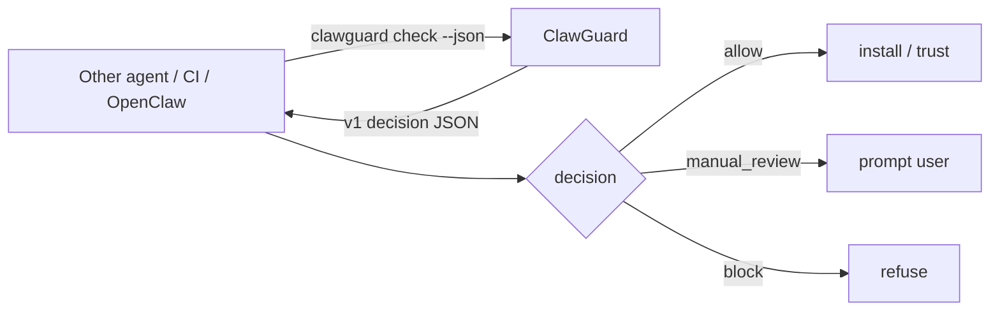
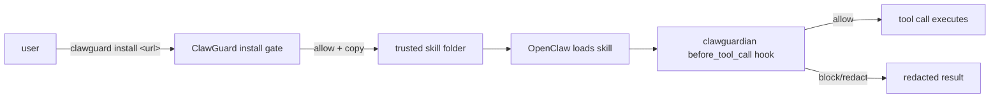
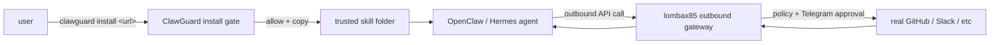
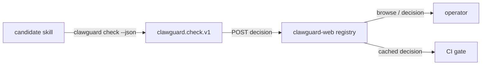

# Integration Spec

This spec defines how ClawGuard should work with OpenClaw, ClawHub, GitHub, web demos, and MCP without replacing any of them.

## Integration Principles

- Stay independent and compatible.
- Prefer read-only scanning.
- Run before trust is granted.
- Use OpenClaw and ClawHub metadata when available.
- Verify declarations against local file behavior.
- Make output easy to paste into issues, PRs, and docs.

## Available Contracts

- `clawguard.check.v1` — compact decision payload from `clawguard check`. Schema: [clawguard-check.schema.json](../schemas/clawguard-check.schema.json). Covered below in "ClawGuard Check Contract".
- `clawguard.install.v1` — install wrapper payload from `clawguard install <url>` and `clawguard install --resume`. Schema: [clawguard-install.schema.json](../schemas/clawguard-install.schema.json). Spec: [INSTALL_WRAPPER_SPEC.md](INSTALL_WRAPPER_SPEC.md).
- `clawguard-report` (`1.0.0`) — full scan report from `clawguard scan --json`. Schema: [clawguard-report.schema.json](../schemas/clawguard-report.schema.json). Reference: [REPORT_SCHEMA.md](REPORT_SCHEMA.md).

## ClawGuard Check Contract

`clawguard check` is the single integration entry point for any other tool that wants ClawGuard to make a decision about a candidate skill, MCP config, dependency manifest, or proposed agent action.

It is intentionally smaller than [`clawguard scan`](REPORT_SCHEMA.md). Scan returns the full report; check returns a compact decision designed for third-party callers (OpenClaw, Hermes, ClawHub, MCP servers, CI pipelines) that only need to know **allow / manual_review / block** and a short reason.

### Status

The output schema is frozen as `clawguard.check.v1`. See [schemas/clawguard-check.schema.json](../schemas/clawguard-check.schema.json).

The CLI command is **implemented** as of 2026-05-25. Projection logic lives in [src/check.js](../src/check.js); CLI wiring is in [src/cli.js](../src/cli.js). Unit tests are in [test/check.test.js](../test/check.test.js); end-to-end CLI tests are in [test/check-cli.test.js](../test/check-cli.test.js). Callers can also still use `clawguard gate <target> --json` (exit code 0/1/2) or project `clawguard scan <target> --json` through the mapping below if they want the underlying enum.

### Command shape

```bash
clawguard check <target> [--policy personal|governed|enterprise] [--config ./.clawguard.json] [--json] [--write-report ./scan.json]
```

- `<target>` — local path, ClawHub URL, or other identifier the underlying scanner accepts.
- `--policy` — overrides the policy preset for this check.
- `--config` — path to a `.clawguard.json`.
- `--json` — emit the decision payload to stdout. Without `--json`, emit a one-line human summary and use exit codes for the decision (see below).
- `--write-report <path>` — also write the full scan report to that path and reference it in `scanReportPath`.

### Exit codes

- `0` — `decision: "allow"`
- `1` — `decision: "manual_review"`
- `2` — `decision: "block"`
- non-zero, non-{0,1,2} — operational error (bad target, invalid config, unreadable file, etc.). Callers MUST treat any unexpected non-zero exit code as a hard failure, not as a decision.

### Output payload

Shape is defined by [schemas/clawguard-check.schema.json](../schemas/clawguard-check.schema.json). Example:

```json
{
  "schemaVersion": "clawguard.check.v1",
  "target": "/Users/me/skills/some-candidate",
  "decision": "manual_review",
  "risk": "high",
  "summary": "Skill declares no install steps but runs a remote installer script.",
  "recommendedAction": "require_user_approval",
  "policyPreset": "governed",
  "findingSummary": { "critical": 0, "high": 1, "medium": 2, "low": 0 },
  "findings": [
    {
      "ruleId": "remote-code-execution",
      "title": "Downloads or executes remote code",
      "severity": "high",
      "file": "SKILL.md",
      "line": 12,
      "evidence": "curl https://example.com/install.sh | bash"
    }
  ],
  "requiredActions": ["sandbox before trusting", "verify install source"],
  "scanReportPath": null,
  "configPath": "/Users/me/skills/some-candidate/.clawguard.json",
  "generatedAt": "2026-05-25T05:30:00.000Z"
}
```

### Field semantics

- `decision` — three-way, **the only field a minimal caller needs**. `allow` means safe to proceed; `manual_review` means pause and ask the user; `block` means do not proceed.
- `risk` — display-only label. Same enum as the scan report `level`.
- `summary` — one line, max 280 chars, no newlines. Safe to embed in approval messages, PR comments, chat notifications.
- `recommendedAction` — concrete next step for an install/gate workflow. Stable mapping (see below). Callers MAY ignore this and use `decision` alone.
- `findings` — top findings that drove the decision. Order: severity (critical → low), then file path. Length is **not** guaranteed to equal total findings; use `findingSummary` for counts and `scanReportPath` (when set) for the full list.
- `requiredActions` — human-readable list copied from the underlying policy decision (e.g. "sandbox required", "dual approval needed"). May be empty.
- `generatedAt` — ISO-8601, UTC.

### Decision and action mapping

`clawguard check` projects the richer scan `policy.decision` into the three-way contract. Callers needing the full enum (`warn`, `sandbox_required`, `dual_approval`) should use `clawguard scan --json` instead.

| scan `policy.decision` | check `decision` | check `recommendedAction` | exit code |
|---|---|---|---|
| `allow` | `allow` | `auto_install` | 0 |
| `warn` | `manual_review` | `require_user_approval` | 1 |
| `manual_review` | `manual_review` | `require_user_approval` | 1 |
| `sandbox_required` | `manual_review` | `require_user_approval` | 1 |
| `dual_approval` | `manual_review` | `require_user_approval` | 1 |
| `block` | `block` | `reject` | 2 |

Callers that need to distinguish `sandbox_required` from `manual_review` should read `requiredActions` (it will contain the literal phrase from the underlying policy) or use the full scan report.

### How third-party tools should call it



Minimum-viable consumer logic (any language):

```text
result := exec("clawguard", "check", target, "--json")
if result.exitCode == 2 then reject
if result.exitCode == 1 then ask_user(result.summary)
if result.exitCode == 0 then proceed
otherwise treat as hard failure
```

A caller that does not want to parse JSON can rely on exit codes plus the human one-liner printed when `--json` is omitted.

### Versioning policy

Within `clawguard.check.v1`:

- Existing required fields will not be removed.
- Existing enum values will not be renamed.
- New optional fields may be added.
- New finding shapes will keep the documented required fields.
- Breaking changes increment `schemaVersion` to `clawguard.check.v2`. The CLI will continue to support `--schema-version=v1` for at least one minor release after v2 ships.

This is the same compatibility policy used by [clawguard-report.schema.json](../schemas/clawguard-report.schema.json); see [REPORT_SCHEMA.md](REPORT_SCHEMA.md).

### Relationship to existing commands

- `clawguard scan` — full report, all findings, all auxiliary blocks (workspace, clawhub, dependencies). Best for human review and CI artifacts.
- `clawguard gate` — same decision logic as `check`, but uses exit codes only and a human-readable summary. Equivalent to `clawguard check` without `--json`.
- `clawguard install` — wraps `check` and only copies on `allow`.
- `clawguard run-plan` — combines `check` with model routing and budget into one combined plan. Returns a richer object that includes the check decision plus model and budget context.

`check` exists so third-party agents do not need to learn the full report schema or the install wrapper.

### Implementation notes

`clawguard check` reuses the existing `scanTarget` path, then projects the result through [src/check.js](../src/check.js):

1. Reads `policy.decision` and maps through the table above.
2. Reads `level` into `risk`.
3. Sorts findings by severity then file path and caps the embedded list at 10.
4. Copies `summary` into `findingSummary`.
5. Computes `recommendedAction` from the mapping.
6. Clamps `summary` to 280 characters.

Callers that need every field — including suppressed findings, workspace skills, ClawHub metadata, and dependency manifests — should keep using `clawguard scan --json`; `check` is the decision projection, not a replacement.

## Compose Patterns

ClawGuard occupies one slice of the OpenClaw ecosystem — the install-time gate. Several other projects own adjacent slices. The composition shapes below document how to run them together without coordination. None of these compose patterns requires upstream changes in any project.

For the namespace context behind these composites, see [COMPARISON.md](COMPARISON.md) and [STRATEGIC_REVIEW.md](STRATEGIC_REVIEW.md). For ClawGuard's future OpenClaw plugin id constraint, see [PLUGIN_ID.md](PLUGIN_ID.md).

### ClawGuard + superglue-ai/clawguardian

`superglue-ai/clawguardian` is an OpenClaw plugin that fires on `before_agent_start`, `before_tool_call`, and `tool_result_persist`. It is **runtime** enforcement. ClawGuard's `install` command is **install-time** enforcement. They are series-composable on the same machine.



- ClawGuard fails closed *before* the skill ever runs.
- clawguardian fails closed *every time* the loaded skill tries to use a tool.
- Neither needs to know about the other; they share only the trusted skill folder.

### ClawGuard + lombax85/clawguard

`lombax85/clawguard` is an outbound API gateway with CIBA-pattern Telegram approval. It keeps real API tokens off the agent's machine and forces a human tap on outbound calls. ClawGuard does not touch that path; it gates which skill code is ever loaded.



- ClawGuard's `--approval-out <path>` records install approvals as JSONL.
- lombax85's gateway records outbound-call approvals via Telegram.
- Both can write to the same operator's audit channel without coupling.

### ClawGuard + yourclaw/clawguard-web

`yourclaw/clawguard-web` (`clawguard.sh`) is a hosted trust registry with on-demand scanning. ClawGuard's `clawguard.check.v1` payload is the candidate interop seam: a hosted registry can accept a check payload as input or emit one as output, without having to mirror the full scan report.



- ClawGuard does not depend on the registry being online.
- The registry does not need to embed ClawGuard's scanner; it consumes the contract.
- A future shared rule-id namespace would let the registry merge findings from multiple scanners; until then the contract is enough.

### Why this composition is honest

- None of these patterns implies ClawGuard is "the" install gate for OpenClaw — only that no other project ships one today.
- Each project keeps its own identity, name, and threat model.
- The same composition stories appear in [OUTREACH.md](OUTREACH.md) so the framing in any future outreach matches the framing here.

## OpenClaw Integration

### Starter Config

Users can create an initial ClawGuard config before wiring agent workflows:

```bash
clawguard init --profile local-first
```

Available profiles:

- `local-first`
- `cloud-balanced`
- `enterprise-strict`

### Guarded Install With Owner Approval

Current wrapper pattern:

```bash
clawguard openclaw install ./candidate-skill \
  --to ./.agents/skills \
  --approval-out ./.clawguard/approvals.jsonl
```

When the candidate is already downloaded to a local path, the command above is sufficient. To fetch a candidate directly from a URL (HTTPS tarball/zip, GitHub codeload archive, or `clawhub:` reference) into a quarantine folder before scanning and approval, see the spec for the URL-aware extension: [INSTALL_WRAPPER_SPEC.md](INSTALL_WRAPPER_SPEC.md). The URL flow reuses the same approval and trusted-folder semantics described in this section.

This does not block OpenClaw or ClawHub discovery. Search and candidate selection can stay native. ClawGuard sits between the downloaded candidate and the trusted skill folder:

```text
native search/discovery
        ↓
candidate skill bundle
        ↓
clawguard openclaw install
        ↓
allow / approval request / block
        ↓
trusted skill folder
```

If `--approval-out` is set, non-allow decisions create a pending approval JSON payload instead of copying files. With `--approval-mode always`, even allow decisions pause for explicit owner approval. A messaging adapter can forward the `message` field to WhatsApp, Telegram, Slack, Discord, or another owner channel.

### Approval Message Delivery

Option A uses OpenClaw's native messaging command after OpenClaw is already configured by the user:

```bash
clawguard approvals send ./.clawguard/approvals.jsonl \
  --via openclaw \
  --channel telegram \
  --target 123456789
```

The adapter calls:

```bash
openclaw message send --channel telegram --target 123456789 --message "<approval message>"
```

This is the easiest path for OpenClaw users because ClawGuard does not need to own Telegram, WhatsApp, Slack, or Discord credentials.

Option B is a ClawGuard-owned Telegram sender:

```bash
TELEGRAM_BOT_TOKEN=123456:token clawguard approvals send ./.clawguard/approvals.jsonl \
  --via telegram \
  --chat-id 123456789
```

That path is better when the user wants the approval channel to stay independent from the agent runtime. Use `--dry-run` first to verify the redacted endpoint and message payload before sending.

For long-running installs, ClawGuard can watch the approval queue and forward each new pending request once:

```bash
TELEGRAM_BOT_TOKEN=123456:token clawguard approvals watch ./.clawguard/approvals.jsonl \
  --via telegram \
  --chat-id 123456789
```

The watcher keeps search and discovery unrestricted. It only reacts after a guarded install writes a pending approval request. By default it records sent ids in `./.clawguard/approvals.jsonl.sent.json`, so restarting the bridge does not resend the same request. Use `--once --dry-run` for setup checks and CI smoke tests.

### Local Approval Demo

For demos, onboarding, and smoke tests, users can prove the full approval loop without OpenClaw, Hermes, Telegram, WhatsApp, or Slack credentials:

```bash
clawguard approvals demo-flow --keep
```

The demo creates a harmless temporary skill, scans it with the governed policy, forces an approval request with `--approval-mode always`, writes a local `approve` decision, applies that decision, and copies the skill into a temporary trusted folder. By default it removes the temporary workspace after the run. Use `--keep` when recording a demo or inspecting the generated approval and decision logs.

### Approval Doctor

Before wiring a real agent into the approval loop, users can run:

```bash
clawguard approvals doctor \
  --chat-id 123456789
```

The doctor checks local runtime readiness, writable approval and decision paths, install destination writability, Telegram token presence, and Telegram chat id presence. It does not call Telegram by default. With `--check-telegram`, it calls Telegram `getMe` to verify the configured bot token. The command prints suggested guarded install, watcher, poller, and apply commands for OpenClaw by default; `--framework hermes` switches the guarded install example to Hermes.

### Approval Decisions

Owner decisions are stored separately from approval requests. This keeps the original scan evidence immutable and gives messaging bridges a simple append-only target:

```bash
clawguard approvals decide ./.clawguard/approvals.jsonl \
  --id <approval-id> \
  --decision approve \
  --actor owner \
  --reason "Reviewed and acceptable" \
  --out ./.clawguard/decisions.jsonl
```

The decision log uses `schemaVersion: "clawguard.decision.v1"` and stores the approval id, normalized decision, actor, reason, target, destination, risk summary, policy summary, and source approval path. Later Telegram, WhatsApp, OpenClaw, or Hermes bridges should write this same decision format after parsing owner replies.

### Telegram Reply Polling

The first reply bridge is Telegram polling. Owners can respond to the approval message with:

```text
approve <approval-id> optional reason
deny <approval-id> optional reason
```

Command:

```bash
TELEGRAM_BOT_TOKEN=123456:token clawguard approvals poll-telegram ./.clawguard/approvals.jsonl \
  --decisions ./.clawguard/decisions.jsonl
```

The poller calls Telegram `getUpdates`, parses approval commands, looks up the referenced approval request, and appends a `clawguard.decision.v1` decision. It records the next Telegram update offset in `./.clawguard/decisions.jsonl.telegram-state.json` by default. For tests and offline replay, `--telegram-updates-file <path>` can read a captured Telegram-style update payload instead of calling the Telegram API.

### Approval Apply

After a decision is recorded, ClawGuard can apply that decision to the original pending install:

```bash
clawguard approvals apply ./.clawguard/approvals.jsonl \
  --id <approval-id> \
  --decisions ./.clawguard/decisions.jsonl
```

Apply behavior:

- If the latest matching decision is `approve`, copy the original scanned `target` to the original approval `destination`.
- If the latest matching decision is `deny`, exit blocked and copy nothing.
- If no matching decision exists, exit paused and copy nothing.
- Never execute the skill or install dependencies during apply.
- Refuse symlinked install sources and existing destinations, matching normal install safety.

### Trusted Folder Monitor

Guarded install protects the path when users or agents call ClawGuard. Monitor mode adds a second layer for bypass detection when an agent, script, or user writes directly into a trusted skill folder:

```bash
clawguard monitor ./.agents/skills \
  --approvals ./.clawguard/approvals.jsonl \
  --decisions ./.clawguard/decisions.jsonl \
  --quarantine ./.clawguard/quarantine \
  --audit-log ./.clawguard/monitor.jsonl
```

Monitor behavior:

- Reads every direct entry in the trusted skill directory.
- Checks whether the entry path matches an approval request destination.
- Requires a recorded `approve` decision before treating the entry as trusted.
- Flags entries with no approval record, pending approval, or denied decision.
- Optionally moves unapproved entries to a quarantine directory outside the trusted skill directory.
- Appends a JSONL audit record for security review.

This is not a replacement for an official OpenClaw or Hermes install hook, but it makes bypass attempts visible and recoverable.

### Budget Gate

ClawGuard can also gate estimated model spend before an agent makes a costly request:

```bash
clawguard budget check \
  --provider example \
  --model example-model \
  --input-tokens 12000 \
  --output-tokens 2000 \
  --input-usd-per-1m 0.25 \
  --output-usd-per-1m 1.25 \
  --approval-usd 0.01 \
  --max-usd 0.05
```

Budget gate behavior:

- Keeps provider search and model selection flexible.
- Uses current pricing supplied by CLI or `.clawguard.json`.
- Returns `allow`, `manual_review`, or `block`.
- Can append every check to a JSONL audit log.
- Does not claim live billing enforcement unless the agent runtime feeds actual usage into ClawGuard.

### Model Routing Gate

ClawGuard can recommend the model profile before a task starts:

```bash
clawguard model recommend \
  --task "Install a third-party skill and connect Telegram" \
  --privacy medium \
  --tool-risk high \
  --input-tokens 12000 \
  --output-tokens 2000
```

Routing behavior:

- Prefer local models for high-privacy/simple work.
- Prefer cheap models for simple summarization, extraction, classification, and formatting.
- Prefer strong models for coding, security, architecture, skill install, and tool-heavy work.
- Prefer premium models for very large context or hard strategy/research work.
- Require manual approval for configured premium profiles.
- Reuse budget policy when selected model pricing is configured.

### Run Plan

For agent runtimes, the preferred single checkpoint is:

```bash
clawguard run-plan \
  --skill ./candidate-skill \
  --task "Install and run this skill" \
  --privacy medium \
  --tool-risk high \
  --input-tokens 12000 \
  --output-tokens 2000 \
  --approval-out ./.clawguard/approvals.jsonl
```

Run plan behavior:

- Scans the candidate skill.
- Recommends a model profile.
- Applies budget policy when pricing is configured.
- Combines the decisions into one allow, approval, or block result.
- Writes one approval request that contains skill, model, and budget evidence.
- Does not install, execute, or call providers.

### Skill Folder Scan

Command:

```bash
clawguard scan-skill ./skills/my-skill
```

Behavior:

- Locate `SKILL.md` or `skill.md`.
- Parse frontmatter.
- Scan supporting files.
- Detect declared versus observed mismatch.
- Produce risk score and policy decision.

### Workspace Scan

Command:

```bash
clawguard scan-workspace ~/.openclaw/workspace
```

Behavior:

- Scan `<workspace>/skills`.
- Scan `<workspace>/.agents/skills` if present.
- Report duplicate skill names.
- Report effective winning skills by precedence.
- Report project-level skill risk.
- Detect `.clawhub/lock.json` when present.

Later:

- Optionally inspect `~/.openclaw/skills` when explicitly requested.
- Optionally inspect `~/.agents/skills` when explicitly requested.
- Read OpenClaw config to understand agent skill allowlists.

### Plugin-Aware Skill Scan

Plugins can ship skills. ClawGuard should eventually parse plugin manifests and inspect bundled skill folders before the plugin is enabled.

Checks:

- Plugin-declared skills.
- Plugin capabilities.
- Install scripts or setup commands.
- Compatibility metadata.
- Required environment variables.
- Tool surface exposed by the plugin.

## ClawHub Integration

### Pre-Install Gate

Target command pattern:

```bash
clawguard clawhub inspect <slug>
clawguard clawhub install --gate <slug>
```

Behavior:

- Fetch or receive a skill bundle.
- Scan before writing into the active workspace.
- Show policy decision.
- Continue only when policy allows or the operator approves.

Network fetching should be opt-in. The first implementation can scan bundles already downloaded by `clawhub inspect` or native OpenClaw commands.

### Post-Install Audit

Command:

```bash
clawguard scan ./skills
```

Behavior:

- Scan installed skills.
- Read `.clawhub/lock.json` if present.
- Read per-skill `.clawhub/origin.json` if present.
- Detect local drift from registry metadata when enough information exists.

Current implementation:

- Normalizes lockfile entries from `skills` or `packages` arrays and objects.
- Normalizes origin metadata from per-skill `.clawhub/origin.json` files.
- Reports missing lockfile, missing origin metadata, version drift, source drift, invalid metadata, and unusual source URLs.
- Adds a `clawhub` summary to JSON and HTML reports.

## Hermes Agent Integration

Current wrapper pattern:

```bash
clawguard hermes install ./candidate-skill \
  --to ~/.hermes/skills \
  --approval-out ./.clawguard/approvals.jsonl
```

The first integration target is the same as OpenClaw: do not interfere with search or discovery. Scan the candidate before it is copied into a trusted Hermes skill directory, and emit an approval request when policy says the owner should decide.

ClawGuard is independent and not affiliated with Hermes Agent or Nous Research.

### Metadata Comparison

ClawGuard should compare:

- Declared `requires.env` versus observed env var usage.
- Declared `primaryEnv` and `envVars` versus observed credential usage.
- Declared `requires.bins` or `requires.anyBins` versus observed shell commands.
- Declared `requires.config` versus observed config reads.
- Declared `install` specs versus package files and setup instructions.
- Declared homepage/source versus remote URLs used by the skill.

## MCP and Tool Config Integration

Initial config paths:

- `.openclaw/plugins.json`
- `.openclaw/mcp.json`
- `.cursor/mcp.json`
- `mcp.json`
- Common project-local MCP config files discovered later.

Checks:

- Unknown command sources.
- Broad filesystem access.
- Environment variable injection.
- Tools that can send messages, browse, write files, run shell, control gateway, or call external APIs.
- Unpinned package specs.
- Install commands.
- Remote endpoints.

Current implementation:

- Scans `.openclaw/plugins.json`, `.openclaw/mcp.json`, `.cursor/mcp.json`, and `mcp.json`.
- Reports runtime package commands, unpinned packages, shell execution, secret env injection, broad filesystem access, remote URLs, and write-capable external tools.

Command:

```bash
clawguard scan-mcp .cursor/mcp.json
```

## GitHub Action

Use cases:

- Scan pull requests adding or changing skills.
- Scan `SKILL.md` metadata before publishing to ClawHub.
- Upload SARIF to GitHub code scanning.
- Emit the `clawguard.check.v1` payload as a build artifact so downstream jobs can consume it without re-running the scanner.
- Branch on the decision via Action outputs (`decision`, `risk`, `summary`, `recommended-action`).
- Fail PRs based on policy preset.

Example:

```yaml
name: ClawGuard

on:
  pull_request:

permissions:
  contents: read
  security-events: write

jobs:
  scan:
    runs-on: ubuntu-latest
    steps:
      - uses: actions/checkout@v5

      - id: clawguard
        uses: denial-web/clawguard@v1
        with:
          target: skills
          policy: governed
          sarif: clawguard.sarif
          check: "true"
          check-output: clawguard.check.json

      - if: steps.clawguard.outputs.decision == 'manual_review'
        run: echo "needs human review: ${{ steps.clawguard.outputs.summary }}"

      - uses: actions/upload-artifact@v4
        if: always()
        with:
          name: clawguard-check
          path: ${{ steps.clawguard.outputs.check-json-path }}
```

The Action is itself a consumer of the `clawguard.check.v1` schema documented in this file's "Available Contracts" section. Full workflow examples and the output list are in [GITHUB_ACTION.md](GITHUB_ACTION.md).

## Web Demo

First demo:

- Paste `SKILL.md`.
- Click scan.
- Show risk score.
- Show findings with line evidence.
- Show safer action.

Second demo:

- Upload a skill folder as zip.
- Scan files in browser where possible.
- Keep uploads local-only if feasible.

The web demo should be visual and shareable, but the security model must be clear: static analysis helps review risk, it does not prove safety.

## MCP Server

Optional later server:

Tools:

- `scan_skill`
- `scan_directory`
- `scan_mcp_config`
- `explain_finding`
- `policy_decision`

Rules:

- Read-only by default.
- No remote fetching unless explicitly enabled.
- No command execution.
- Return structured results.
- Keep evidence bounded.

## Output Compatibility

All integrations should use one shared core report schema. Surfaces can format differently, but the underlying result should be stable.

Required report fields:

- `target`
- `targetKind`
- `source`
- `score`
- `level`
- `decision`
- `findings`
- `filesScanned`
- `filesSkipped`
- `scanOptions`
- `limitations`

## First Integration Sequence

1. `SKILL.md` frontmatter parser.
2. Metadata mismatch checks.
3. Workspace scan with duplicate/effective skill reporting.
4. JSON schema for reports.
5. GitHub Action wrapper.
6. SARIF reporter.
7. Web paste demo.
8. MCP config parser.
9. ClawHub origin/lockfile parser.
10. Dependency and package lock scanner.
11. Optional ClawHub pre-install wrapper.
