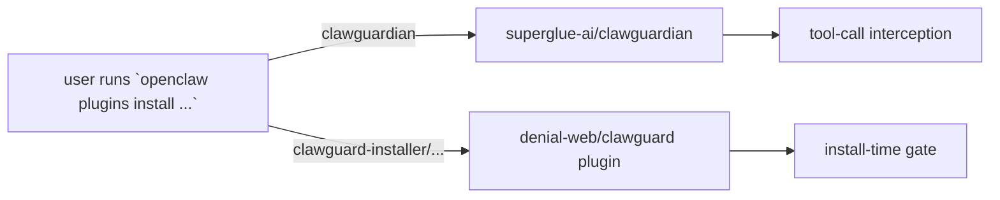

# ClawGuard OpenClaw Plugin ID

Last reviewed: 2026-05-26.

This document records the constraint and current candidates for the identifier ClawGuard would use **if and when** it ships a plugin to the OpenClaw plugin registry. No plugin has been published yet; this page exists so the decision is not made hastily under release pressure.

## Constraint

The slug `clawguardian` is already published by [superglue-ai/clawguardian](https://github.com/superglue-ai/clawguardian). It resolves via `openclaw plugins install clawguardian`. ClawGuard MUST NOT reuse that identifier. See [COMPARISON.md](COMPARISON.md) for the full namespace survey.

## Candidate identifiers

Ranked by clarity and search-distinctiveness:

| Candidate | Pro | Con |
|---|---|---|
| `clawguard-installer` | Names the surface (install-time gating). Hard to confuse with `clawguardian` (tool hooks). | Slightly long; implies install-only and may be wrong once we ship a runtime hook too. |
| `clawguard-gate` | Matches our existing CLI command (`clawguard gate`). | "Gate" is generic; lower SEO. |
| `clawguard-scan` | Honest about the underlying engine. | Understates the policy/decision surface; users may think it is read-only only. |
| `clawguard-installer-gate` | Most explicit. | Verbose. |

## Decision criteria

Final id MUST:

- Be distinct from `clawguardian` at typing distance ≥ 3 characters.
- Be readable and pronounceable in voice.
- Match the surface we actually ship in the plugin (not aspirational scope).
- Not require renaming any current CLI command.

## Current state

- **No plugin published.** ClawGuard ships only as the `@denial-web/clawguard` CLI and `clawguard install <url>` wrapper today.
- **Final id: TBD.** Pick when there is a working plugin prototype, not earlier.
- **Outreach precondition.** Before publishing under any id, mention the namespace overlap in the issues drafted in [OUTREACH.md](OUTREACH.md) so the choice is visible to neighbors.

## Related

- [STRATEGIC_REVIEW.md](STRATEGIC_REVIEW.md) section 9 item 6 — outreach + interop plan.
- [COMPARISON.md](COMPARISON.md) — namespace survey including `clawguardian`.
- [INTEGRATION_SPEC.md](INTEGRATION_SPEC.md) "Compose patterns" — how ClawGuard and `clawguardian` can run together without coordination.
