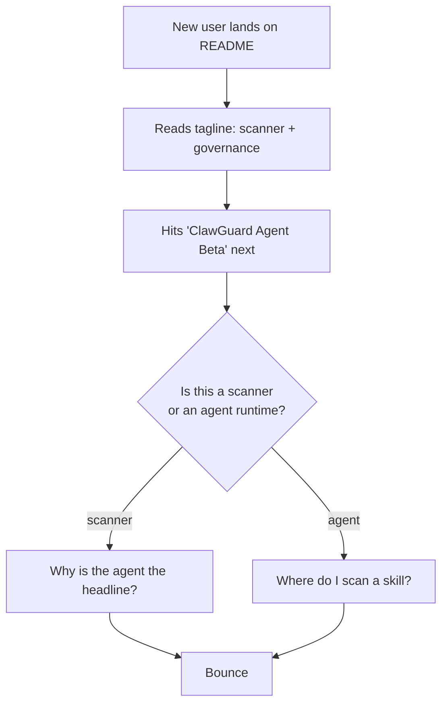

# ClawGuard Strategic Review

Last reviewed: 2026-05-25.

This document is an honest, evidence-based review of where `denial-web/clawguard` stands today, how it compares to the other "ClawGuard" projects on GitHub, and what to do next without changing the project name.

It is intentionally separate from [docs/PROJECT_REVIEW.md](PROJECT_REVIEW.md) (a scanner-feature checklist) and [docs/REAL_WORLD_VALIDATION.md](REAL_WORLD_VALIDATION.md) (ClawHub compatibility validation). This review is about positioning, differentiation, and product clarity.

No code changes are proposed here. The goal is a single document that can be shared, debated, and then turned into follow-up plans if any recommendation is approved.

---

## 1. Snapshot

What `denial-web/clawguard` is today:

- A static security scanner for OpenClaw-style skills, ClawHub installs, MCP configs, and dependency manifests.
- A governed AI agent runtime (ClawGuard Agent) layered on top of the scanner, with policy, approval, protected assets, hash-chained audit, memory, subagents, blast-radius explain, and a browser/app proposal bridge.
- Published to npm as `@denial-web/clawguard`, currently `1.0.0-beta.7` (see [package.json](../package.json)).
- Repository: [github.com/denial-web/clawguard](https://github.com/denial-web/clawguard). At the time of this review: 0 stars, 0 forks.
- 44 test files, deterministic safety eval suite at [safety_eval/](../safety_eval/), CI on Node 24 ([.github/workflows/ci.yml](../.github/workflows/ci.yml)).
- 97 documents under [docs/](.), and a 761-line [README.md](../README.md) covering scanner, agent, SOP packs, USB handoff, mobile handoff, financial governor, physical device governor, and more.

The product is broader than most users will absorb in a first read. That breadth is both the strength and the central problem.

---

## 2. The namespace problem

"ClawGuard" is a contested name in the OpenClaw ecosystem. As of this review, at least six other public projects use the same or near-identical name:

| Project | Stars | What it is | Surface area |
|---|---|---|---|
| [NeuZhou/clawguard](https://github.com/NeuZhou/clawguard) (npm: `@neuzhou/clawguard`) | 1 | "Firewall for AI agents." 285+ patterns, risk score engine, MCP firewall proxy, TF-IDF anomaly detection, insider-threat rules, SARIF, GitHub Action, LangChain middleware. Zero dependencies, 684 tests. | CLI + library + HTTP server. Started 2026-03-15. |
| [yourclaw/clawguard-web](https://github.com/yourclaw/clawguard-web) + [yourclaw/clawguard-scanner](https://github.com/yourclaw/clawguard-scanner) | 0 | Next.js trust registry, dashboard, on-demand scan, REST `POST /api/v1/scan`. Scanner orchestrates Gitleaks, Semgrep, MCP-Scan, npm audit, and Claude AI review. Owns the domain `clawguard.sh`. | Hosted web platform + scanner orchestrator. Started 2026-02-09. |
| [lombax85/clawguard](https://github.com/lombax85/clawguard) | 15 | Security gateway between an OpenClaw agent and external APIs. CIBA pattern, Telegram approval, zero-knowledge tokens, audit dashboard. | Local gateway service. Started 2026-02-28. |
| [superglue-ai/clawguardian](https://github.com/superglue-ai/clawguardian) | 32 | Official-feeling OpenClaw plugin (`openclaw plugins install clawguardian`) that filters sensitive data in tool calls using `before_agent_start`, `before_tool_call`, and `tool_result_persist` hooks. | OpenClaw plugin. Started 2026-02-02. |
| [clawnify/clawguard](https://github.com/clawnify/clawguard) | 1 | Lightweight agent watchdog. Monitors activity, detects loops/stuck tools/forbidden patterns, takes corrective action. Zero deps, local only. | Local daemon. Started 2026-03-27. |
| [pantherstar/clawguardian](https://github.com/pantherstar/clawguardian) | — | OpenClaw security middleware. Multimodal prompt-injection detection (text, image, PDF, audio), on-chain threat intel on Base Sepolia. | OpenClaw skill + FastAPI service. |

Three observations follow:

1. The word "ClawGuard" no longer uniquely identifies anything. A new user searching GitHub will land on at least three of these before finding `denial-web/clawguard`.
2. The most-starred ClawGuard project ([superglue-ai/clawguardian](https://github.com/superglue-ai/clawguardian), 32 stars) is an OpenClaw plugin that hooks `before_tool_call`. It is integrated where it matters; ours is not.
3. The web-facing "ClawGuard" brand surface (`clawguard.sh`, scan-on-demand registry) is held by [yourclaw](https://github.com/yourclaw/clawguard-web). A user typing "clawguard" into a browser does not find us.

This is the field. Any review of `denial-web/clawguard` has to be read against it.

---

## 3. Where we actually differ

Honest list, not marketing:

- **Scanner plus governed agent runtime in one package.** Most competitors are one or the other. `NeuZhou/clawguard` is a scanner/firewall library; `lombax85/clawguard` is an API gateway; `superglue-ai/clawguardian` is a plugin. None of them ship a full agent runtime with memory, subagents, role packs, SOP packs, and approval-gated tool execution.
- **Hash-chained audit log** with `clawguard agent audit show --verify` ([src/agent/audit.js](../src/agent/audit.js)).
- **Protected assets enforced at the tool layer**, not only at the prompt layer ([src/agent/protected-assets.js](../src/agent/protected-assets.js), [docs/AGENT_THREAT_MODEL.md](AGENT_THREAT_MODEL.md)).
- **Blast Radius Explain** before execution ([src/agent/blast-radius.js](../src/agent/blast-radius.js)).
- **A-S-FLC routing** with `LOCAL`, `VERIFY_FIRST`, `APPROVAL_REQUIRED`, `ESCALATE`, `BLOCK` ([docs/AS_FLC_FOR_CLAWGUARD.md](AS_FLC_FOR_CLAWGUARD.md)).
- **Role packs and SOP packs** ([docs/ROLE_INTELLIGENCE.md](ROLE_INTELLIGENCE.md), [docs/SOP_PACKS.md](SOP_PACKS.md)) — a layer no other ClawGuard touches.
- **Approval-gated memory** with review/approve/reject/replace/consolidate lifecycle ([docs/AGENT_MEMORY_POLICY.md](AGENT_MEMORY_POLICY.md)).
- **Bounded local subagents** that inherit policy and cannot nest.
- **Deterministic agent safety eval** under [safety_eval/](../safety_eval/) covering proposal validation, deep-thinking triggers, professional-worker critic, blast radius, protected paths, web-fetch redirects, bridge approval replay, and channel-bound approvals.
- **Zero runtime dependencies in the core scan path.** `yourclaw/clawguard-scanner` orchestrates five external tools; we do not.
- **Inter-component channel threat model** ([docs/INTER_COMPONENT_CHANNEL_THREAT_MODEL.md](INTER_COMPONENT_CHANNEL_THREAT_MODEL.md)) — a formal trust boundary none of the competitors document.

These are real. The question is whether users see them.

---

## 4. Where we look weak vs the field

Also honest:

- **Zero stars, no domain, no plugin hook.** [superglue-ai/clawguardian](https://github.com/superglue-ai/clawguardian) has 32 stars because it installs *inside* OpenClaw and intercepts tool calls. We sit outside the agent runtime and ask the user to invoke us.
- **9,299-line [src/cli.js](../src/cli.js).** Competitors expose clean library APIs (`import { runSecurityScan, calculateRisk } from '@neuzhou/clawguard'`). Ours is a god-object CLI; the library surface is not visible.
- **96 docs files** under [docs/](.), 37 of which are versioned release notes. The 761-line [README.md](../README.md) mixes scanner quickstart, agent feature catalog, SOP packs, USB handoff, mobile handoff, financial governor, physical device governor, and roadmap. A first-time reader cannot answer "what is this?" in under a minute.
- **No SARIF self-scan in CI.** [.github/workflows/ci.yml](../.github/workflows/ci.yml) runs only `npm test` and a smoke action. [NeuZhou/clawguard](https://github.com/NeuZhou/clawguard) advertises one-line SARIF + GitHub Code Scanning integration as a headline feature.
- **No real OpenClaw/Hermes integration hook.** We document compatibility ([docs/REAL_WORLD_VALIDATION.md](REAL_WORLD_VALIDATION.md)) but do not register as a plugin, intercept tool calls, or own an install path.
- **Two products under one name.** ClawGuard (scanner) and ClawGuard Agent (runtime) are both prominent in the README, both compete for the headline, and neither wins it.
- **Beta dependency on npm publishing flow.** Adoption requires `npx --package @denial-web/clawguard@beta`, which is heavier than `npx @neuzhou/clawguard check ...`.

None of these are fatal. All of them are addressable without renaming.

---

## 5. The Core vs Agent confusion

The strongest internal problem is product clarity.

Today, [README.md](../README.md) opens with a one-line tagline ("Security gate and governance scanner..."), then immediately introduces "ClawGuard Agent Beta" before the user has understood ClawGuard itself ([README.md](../README.md) section "ClawGuard Agent Beta" at line 28). A second "ClawGuard Agent" section starts at line 105 and runs ~100 lines before any non-agent material returns.

A user trying to evaluate the project hits this decision tree without warning:



Two value propositions sit at the same level:

- "ClawGuard scans skills, MCP configs, and dependencies before you trust them." (Core)
- "ClawGuard Agent is a governed local AI agent that runs work safely." (Agent)

Both are real. Bundled in one read, they make the project look like a scanner that grew an agent, or an agent that grew a scanner, depending on which paragraph the user reads first. Neither framing is wrong; neither is sharp.

Recommendation (documentation-only, executed in a follow-up plan, not here):

- Use the name **ClawGuard** for the scanner / policy / install gate.
- Use the name **ClawGuard Agent** for the optional runtime built on top.
- Lead the [README.md](../README.md) with Core. Give Agent its own dedicated page under [docs/](.).
- State the relationship in one sentence near the top: *"ClawGuard is the policy and safety gate. ClawGuard Agent is the optional governed runtime that uses it."*

---

## 6. Positioning recommendation (keep the name)

Primary positioning line, suitable for README, npm, and outreach:

> **ClawGuard is the policy and safety gate for OpenClaw-style skills, MCP tools, and agent actions. ClawGuard Agent is the optional governed runtime built on it.**

Implications:

- Lead with Core. Core is what other agents and ecosystems can adopt without trusting our runtime.
- Treat Agent as the upgrade path, not the headline. "Now that ClawGuard can judge actions, let it run safe ones too."
- Stop competing head-on with [NeuZhou/clawguard](https://github.com/NeuZhou/clawguard) on "firewall for AI agents." That framing implies inline interception, which we do not do.
- Stop competing head-on with [lombax85/clawguard](https://github.com/lombax85/clawguard) on "API gateway with Telegram approval." That framing implies a network gateway, which we are not.
- Compete instead on **policy gate + governed runtime**, which no competitor offers as one product.

---

## 7. Differentiation strategy

Concrete angles that survive against the six competitors, given we keep the name:

1. **"Integrates with your agent" (Core) vs "is your agent" (Agent).** Most competitors are one or the other and cannot help users who already chose an agent. ClawGuard Core can sit in front of any agent that calls a CLI or HTTP endpoint.
2. **Stable JSON contract for third-party agents.** Specify and freeze the shape of `clawguard check <target> --json`:
   ```json
   {
     "schemaVersion": "clawguard.check.v1",
     "decision": "allow | manual_review | block",
     "risk": "info | low | medium | high | critical",
     "summary": "one-line explanation",
     "findings": [...],
     "recommendedAction": "auto_install | require_user_approval | reject"
   }
   ```
   None of the six competitors publish a stable cross-tool decision contract. This is a wedge.
3. **Install-wrapper workflow.** `clawguard install <url>` runs: download to quarantine, scan, explain, request approval, then move into the trusted skill folder. [lombax85/clawguard](https://github.com/lombax85/clawguard) gates API calls; [superglue-ai/clawguardian](https://github.com/superglue-ai/clawguardian) gates tool calls; none of them gate the install path end-to-end.
4. **Governance primitives as the Agent's moat, not Core's pitch.** Protected assets, hash-chained audit, A-S-FLC routing, blast radius, role packs, SOP packs — these are too specific for a first-touch user, but they are exactly what a security-conscious operator needs once they have committed. Keep them visible in Agent docs; keep them out of Core's top-line pitch.
5. **Compatibility, not competition.** ClawGuard can scan [superglue-ai/clawguardian](https://github.com/superglue-ai/clawguardian) configurations, gate installs that other ClawGuards do not gate, and produce SARIF for the GitHub Action surface [NeuZhou/clawguard](https://github.com/NeuZhou/clawguard) advertises. Frame other ClawGuards as adjacent layers, not rivals.

---

## 8. Risks of keeping the name

Documented so future decisions are informed, not to argue for renaming:

- **npm short name is taken.** `@neuzhou/clawguard` ships as `npx @neuzhou/clawguard`. Ours requires the longer `npx --package @denial-web/clawguard@beta clawguard ...`. First-touch friction is higher.
- **Domain is taken.** `clawguard.sh` belongs to [yourclaw/clawguard-web](https://github.com/yourclaw/clawguard-web). A user searching "clawguard" on the open web does not land on us first.
- **OpenClaw plugin slug is taken.** `openclaw plugins install clawguardian` already resolves to [superglue-ai/clawguardian](https://github.com/superglue-ai/clawguardian). Any future plugin must use a different identifier.
- **Search ambiguity.** "ClawGuard prompt injection" returns at least three different projects. SEO and word-of-mouth both fragment.
- **Trust-registry risk.** If `clawguard.sh` becomes the de-facto trust registry for OpenClaw skills, our scanner output may be perceived as competing with their hosted score. Consider publishing a stable result schema early so both can interoperate.

None of these block keeping the name. They do mean we must compete on product surface, not on the word itself.

---

## 9. Recommended next moves

Ordered by impact, each tagged with its scope. No code work is implied by this review; each item below should become its own follow-up plan if approved.

1. **[docs]** Trim [README.md](../README.md) to a Core-first quickstart. Move "ClawGuard Agent", "USB / Cursor Handoff", "Mobile Approval Handoff", "Portable Agent Setup", "SOP Packs", "Financial AI Governor", and "Physical Device AI Governor Roadmap" to dedicated pages under [docs/](.). Target: README under 250 lines. *(Done: README trimmed from 761 to 244 lines; agent content moved to [AGENT.md](AGENT.md).)*
2. **[docs]** Add `docs/COMPARISON.md`: a one-page "ClawGuard vs other ClawGuards" comparison that is honest about overlap. Link to all six competitors. Refresh quarterly. *(Done: [COMPARISON.md](COMPARISON.md).)*
3. **[product]** Define and freeze `clawguard check --json` as the cross-tool decision contract. Add `schemas/clawguard-check.schema.json`. Document it in `docs/INTEGRATION_SPEC.md` (extend the existing [docs/INTEGRATION_SPEC.md](INTEGRATION_SPEC.md)). This is the single highest-leverage change for integration. *(Done: spec frozen as `clawguard.check.v1` in [schemas/clawguard-check.schema.json](../schemas/clawguard-check.schema.json); CLI implemented in [src/check.js](../src/check.js) + [src/cli.js](../src/cli.js); tests in [test/check.test.js](../test/check.test.js) and [test/check-cli.test.js](../test/check-cli.test.js).)*
4. **[product]** Specify `clawguard install <url>` as the headline workflow. Even before implementation, write the spec: quarantine path, scan, explain, approve, move-to-trusted. None of the six competitors do this end-to-end. *(Done: spec frozen as `clawguard.install.v1` in [INSTALL_WRAPPER_SPEC.md](INSTALL_WRAPPER_SPEC.md); CLI implemented in [src/install-url/](../src/install-url/) for HTTPS `.tar.gz` / `.tgz` plus `--resume`; payload contract in [schemas/clawguard-install.schema.json](../schemas/clawguard-install.schema.json); tests in [test/install-url-cli.test.js](../test/install-url-cli.test.js) and [test/install-url/](../test/install-url/). Zip and `clawhub:` deferred to v1.1.)*
5. **[community]** Refresh [docs/REAL_WORLD_VALIDATION.md](REAL_WORLD_VALIDATION.md) (last checked 2026-05-08) to include a competitor scan. Document what each ClawGuard does, where they overlap with us, and where they are complementary. *(Done: refreshed 2026-05-25 with a "Competitor Landscape Validation" survey of all six projects. Runtime scan of competitor source code is listed as a gap for the next refresh.)*
6. **[community]** Open conversations with [superglue-ai/clawguardian](https://github.com/superglue-ai/clawguardian) and [lombax85/clawguard](https://github.com/lombax85/clawguard) as potential integration partners. They own surfaces (OpenClaw plugin hook; API gateway) that we do not; we own surfaces (install gate; governed runtime; SOP/role packs) that they do not. *(Drafts ready in [OUTREACH.md](OUTREACH.md): two primary issue templates plus secondary targets and a pre-send checklist. "Compose Patterns" section added to [INTEGRATION_SPEC.md](INTEGRATION_SPEC.md) and plugin-id constraint recorded in [PLUGIN_ID.md](PLUGIN_ID.md). Nothing sent yet; outreach log is empty by design.)*
7. **[docs]** Add `docs/AGENT_README.md` or rename the existing agent-heavy material into one anchor page. Make "is this the scanner or the agent?" answerable in one click.

---

## 10. What this review deliberately does not do

To keep scope honest:

- **No renaming.** The name ClawGuard stays. All recommendations assume that.
- **No code restructure.** The 9,299-line [src/cli.js](../src/cli.js) is a real problem (covered in [docs/PROJECT_REVIEW.md](PROJECT_REVIEW.md)), but it is not a positioning problem and is out of scope here.
- **No CI changes.** SARIF self-scan, Node matrix, `node --check`, and `npm pack --dry-run` are tracked in [docs/V1_BETA_HARDENING.md](V1_BETA_HARDENING.md); not duplicated here.
- **No npm packaging changes.** What ships under [package.json](../package.json) `files` is out of scope.
- **No release work.** No GitHub Release, no version bump, no publish.

Each of those is a valid follow-up plan; none is this plan.

---

## Appendix: source links used in this review

Local:

- [README.md](../README.md)
- [package.json](../package.json)
- [.github/workflows/ci.yml](../.github/workflows/ci.yml)
- [docs/PROJECT_REVIEW.md](PROJECT_REVIEW.md)
- [docs/REAL_WORLD_VALIDATION.md](REAL_WORLD_VALIDATION.md)
- [docs/AGENT_THREAT_MODEL.md](AGENT_THREAT_MODEL.md)
- [docs/AGENT_MEMORY_POLICY.md](AGENT_MEMORY_POLICY.md)
- [docs/AS_FLC_FOR_CLAWGUARD.md](AS_FLC_FOR_CLAWGUARD.md)
- [docs/ROLE_INTELLIGENCE.md](ROLE_INTELLIGENCE.md)
- [docs/SOP_PACKS.md](SOP_PACKS.md)
- [docs/INTER_COMPONENT_CHANNEL_THREAT_MODEL.md](INTER_COMPONENT_CHANNEL_THREAT_MODEL.md)
- [docs/INTEGRATION_SPEC.md](INTEGRATION_SPEC.md)
- [docs/V1_BETA_HARDENING.md](V1_BETA_HARDENING.md)
- [safety_eval/](../safety_eval/)
- [src/cli.js](../src/cli.js)
- [src/agent/audit.js](../src/agent/audit.js)
- [src/agent/blast-radius.js](../src/agent/blast-radius.js)
- [src/agent/protected-assets.js](../src/agent/protected-assets.js)

External:

- [github.com/denial-web/clawguard](https://github.com/denial-web/clawguard)
- [github.com/NeuZhou/clawguard](https://github.com/NeuZhou/clawguard)
- [github.com/yourclaw/clawguard-web](https://github.com/yourclaw/clawguard-web)
- [github.com/yourclaw/clawguard-scanner](https://github.com/yourclaw/clawguard-scanner)
- [github.com/lombax85/clawguard](https://github.com/lombax85/clawguard)
- [github.com/superglue-ai/clawguardian](https://github.com/superglue-ai/clawguardian)
- [github.com/clawnify/clawguard](https://github.com/clawnify/clawguard)
- [github.com/pantherstar/clawguardian](https://github.com/pantherstar/clawguardian)
